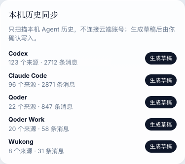

# Agent Memory Hub

[官网](https://aihub0508.com/) | [Gitee 镜像](https://gitee.com/liuyang0508/Agent-Memory-Hub) | [技术共创群](#community) | [English](./README.md) | [快速使用](#quick-start) | [生命周期图](#diagram-lifecycle) | [能力账本](#capability-ledger) | [评测门禁](#system-benchmark-gate) | [架构图谱](#architecture-map)

[](https://aihub0508.com/)
[](https://gitee.com/liuyang0508/Agent-Memory-Hub)
[](#community)
[](#why-shared-second-brain)
[](#runtime-integration-model)
[](#maintenance-flow)
[](#recall-flow)
[](#algorithm-map)
[](#algorithm-map)
[](#recall-flow)
[](#system-benchmark-gate)

<p align="center">
  
</p>

<a id="community"></a>

## 国内镜像与技术共创群

- GitHub 主仓库：[liuyang0508/Agent-Memory-Hub](https://github.com/liuyang0508/Agent-Memory-Hub)
- Gitee 国内镜像：[liuyang0508/Agent-Memory-Hub](https://gitee.com/liuyang0508/Agent-Memory-Hub)，适合 GitHub 访问不稳定的同学克隆源码和跟进更新。
- 技术交流群统一命名为 **Agent Memory Hub 技术共创群**。它用于安装支持、适配器接入证据、召回问题反馈、评测样本共创和长期路线讨论；二维码或邀请链接以官网社区入口为准，也可以在 GitHub / Gitee issue 留言获取。

<a id="quick-nav"></a>

## 快速定位

| 你现在可能在想 | 可以先看 |
|---|---|
| 如果你想了解为什么多智能体需要共享第二大脑 | [为什么多智能体需要共享第二大脑](#why-shared-second-brain) |
| 如果你关心 AMH 在 Loop Engineering 里到底承担哪一层职责 | [从 Loop Engineering 看 AMH](#loop-engineering-view) |
| 如果你想先验证安装体验：doctor、写入、搜索能不能跑通 | [快速入门：3 分钟完成安装、写入和召回](#quick-start) |
| 如果你想启动本地后管、同步各个 Agent 的本机历史记忆；如果 AMH 对你造成了烦恼，也可一键卸载 | [本地后管、本机历史同步和一键卸载](#local-admin-history-sync) |
| 如果你想了解 AMH 适用于哪些 Agent 赋能场景 | [跨角色业务场景示例：以电商为例](#ecommerce-story) |
| 如果你比较关注用户下发的任务指令、Agent 执行任务的产物如何变成可注入上下文 | [用一个真实问题看懂 AMH](#running-example) |
| 如果你关心如何采集、存储、审计各个 Agent 相关记忆 | [维护完整链路](#maintenance-flow) |
| 如果你对多智能体之间如何共享、召回和装载记忆比较感兴趣 | [召回完整链路](#recall-flow) |
| 如果你想看 BM25、向量、RRF、短语增强、rerank、decay、feedback、MMR、Hopfield、graph 和防火墙如何分工 | [算法地图](#algorithm-map) |
| 如果你想核对系统评测怎么跑、横评边界是什么、哪些结论不能写成结果 | [系统级验证门禁](#system-benchmark-gate) |
| 如果你想看 AMH 参考了哪些外部资料、竞品和 benchmark，以及哪些只能作为参考 | [外部资料与竞品对标](#external-references-and-competitor-benchmark) |
| 如果你想核对能力有没有证据，架构图和能力账本是否对得上 | [能力账本](#capability-ledger)、[工程架构图谱](#architecture-map) |

如果只想先判断 AMH 是不是你要的东西，可以先记住这一版：

- **AMH 是共享第二大脑**：把不同 Agent 产生的事实、决策、经验、产物和交接沉淀成同一个本地可信上下文层。
- **AMH 不是 transcript 仓库**：原始聊天先作为 Evidence 保存，长期复用必须提炼成 `MemoryItem`。
- **搜到不等于注入**：候选会经过排序、时效、反馈、冲突、敏感性和 token 预算检查，最后才进入 `ContextPack`。
- **评测要看口径**：同 runner / 同 dataset / 同 metric 才能横向比较；不同 benchmark 或公开自报数字只能作为参考。

<a id="sixty-second-amh"></a>

## AMH 在解决什么问题

AMH 解决的是“一个 Agent 学到的东西，另一个 Agent 用不上”的问题。

多智能体协作真正卡住的，是长期上下文被锁在各自工具里。一个 Agent 做过的调研、整理过的客户背景、确认过的会议决策、沉淀过的写作口径，换到另一个 Agent 默认看不到；研发场景里也一样，Claude Code 记住的根因、约定和验证结果，Codex 不会自动继承。结果是每个 Agent 都像第一次接手任务，用户反复解释同一段背景，旧结论还散在各自的 transcript 里，无法判断哪条仍然有效。

AMH 解决的就是这层共享记忆问题：把不同 Agent 和不同工作流里值得复用的内容提炼成可追溯的 `MemoryItem`，再用统一检索、排序、防火墙和 `ContextPack` 按需注入。它更接近一个本地优先的可信上下文操作系统，而不是聊天记录仓库。Agent 看到的不是另一个工具的整段聊天记录，而是经过来源、有效期、反馈和预算治理后的上下文。

先把 AMH 理解成三件事：

| 它解决的断点 | AMH 做什么 | 用户得到什么 |
|---|---|---|
| 记忆不能跨 Agent 复用 | 把可复用结论写成本地 `MemoryItem`，由 CLI / MCP / SDK / Web / hooks 共用。 | 换 Agent、换角色、换会话时，不必从零解释背景。 |
| 原始聊天不能直接当事实 | 把 live prompt、transcript、文件和资源先放入 Evidence，再经 WriteService 提炼长期记忆。 | 噪声、隐私、过期状态和被否定建议不会直接污染 prompt。 |
| 搜到内容不等于该注入 | 召回后再过 decay、feedback、supersession、ContextFirewall 和 token budget。 | Agent 获得的是当前任务可用的 locator / overview / detail，而不是一整仓聊天记录。 |

<a id="loop-engineering-view"></a>

## 从 Loop Engineering 看 AMH

- **把值得复用的结论沉淀成记忆**：决策、事实、经历、产物、信号、交接进入 `items/mem-*.md`，而不是把原始对话当记忆。
- **把“怎么想起这条记忆”变成可解释链路**：查询信号、结构过滤、BM25、向量、RRF、重排、遗忘衰减、反馈、Hopfield/图谱扩展、上下文防火墙都有轨迹可查。
- **把“召回之后如何进入智能体上下文”变成分层装载**：默认只给定位或概览，必要时才升到详情；详情通过 `detail_uri`、CCR 旁路或 `memory read --view detail` 可逆读取。
- **把长循环变成可验证契约**：Loop Contract 把 goal、state、action、feedback、verifier、budget、stop condition、human gate 固化下来，让 AMH 成为多智能体循环的事实层、验证层和治理层，而不是默认自动 runner。

Loop Engineering 的核心观点是：不要只提示一个智能体做一次任务，而要设计一个可以反复运行、隔离并复核的回路。这个回路通常需要目标、隔离、技能、连接器、复核、记忆和可验证停止条件。

AMH 的边界更收敛：它不接管执行，不替代人的验收，也不把原始 transcript 当成长期知识。不同 Agent 可以负责发现、修改、复核、解释或发布；AMH 只负责把它们共享的上下文稳定下来，让下一轮 loop 知道目标是什么、证据在哪里、哪些事实可信、哪些候选被拒绝、完成标准是否真的满足。

| Loop 要素 | 文章里的作用 | AMH 对应的真实边界 |
|---|---|---|
| Automations / Goals | 按节奏或直到目标满足为止反复运行。 | `LoopRun`、runtime events、checkpoint 和 verification ledger 记录目标、预算、进度和结果；AMH 不自动替你创建分支或发布。 |
| Worktrees | 隔离并行 Agent 的工作区，降低文件冲突。 | AMH 记录 `cwd`、project、adapter、session 和 artifact provenance；隔离本身由 Codex、Claude Code 或 git worktree 提供。 |
| Skills | 把项目约定写到 Agent 外部，避免每次重新说明。 | 记忆纪律、handoff 模板、MemoryItem、context_pack 和 retrieve hint 让可复用知识在 Agent 外部沉淀。 |
| Plugins / Connectors | 连接代码仓库、文档、票据、浏览器等工具。 | CLI / MCP / SDK / Web / hooks / adapter config 是 AMH 的接入面；具体外部系统仍由对应工具和权限控制。 |
| Sub-agents | maker 和 checker 分开，避免同一执行者直接给自己的结果背书。 | `SubagentStart`、`SubagentStop`、review evidence、feedback 和 benchmark gate 记录复核证据；AMH 不把“通过”伪装成证明。 |
| Memory | 让明天的 loop 接上今天的状态。 | Evidence、MemoryItem、Index Projection、Runtime Ledger、ContextFirewall、ContextPack 构成共享第二大脑。 |
| Verifiable stop | 任务结束必须有可检查条件。 | `memory loop complete` 需要 evidence；README、doctor、pytest、Playwright、benchmark 和人工验收共同组成完成证据。 |

所以 AMH 的架构图不是传统“模块清单”。它应该先回答一个问题：一个任务从用户意图进入，到证据沉淀、候选召回、上下文注入、复核验收、反馈治理，怎样回到下一次执行。后面的图谱都按这条 loop 展开。

<a id="why-shared-second-brain"></a>

## 为什么多智能体需要共享第二大脑

今天使用 AI 的人不只是在写代码。一个产品经理可能让 Agent 做访谈整理、需求拆解和 PRD；一个运营同学可能让 Agent 维护活动节奏、素材口径和复盘结论；客服、销售、研究、管理者也会把不同任务交给不同 Agent。每个工具都有自己的会话历史、配置入口、hook、MCP 和上下文读取方式；它们会记住自己参与过的事，但默认不会把这些记忆共享给其他工具。没有共享第二大脑，就会出现很具体的问题：调研 Agent 整理过的客户背景，写作 Agent 用不上；会议里确认过的决策，执行 Agent 不知道；Claude Code 沉淀的技术记忆，也无法在 Codex 里直接使用。

共享第二大脑不是为了“把所有聊天同步一份”。它真正服务的是这些工作切换：

| 切换类型 | 没有 AMH 时 | 有 AMH 时 |
|---|---|---|
| 换工具 | Claude Code、Codex、Qoder、Cursor 等各记各的。 | 同一条 `MemoryItem` 可以被不同 Agent 按需召回。 |
| 换角色 | 产品、运营、研发、客服、销售各自解释一遍背景。 | 商品口径、客户背景、技术边界和复盘结论进入同一事实层。 |
| 换阶段 | 调研、执行、验收、复盘之间靠人手动转述。 | Evidence、MemoryItem、Runtime Ledger、Feedback 形成可追溯链路。 |
| 换时间 | 一周后只剩旧 transcript，很难判断哪条结论仍有效。 | decay、supersession、maturity 和 review 让旧记忆有时效和治理状态。 |
| 换机器/环境 | 安装成功、运行成功、上下文真实注入容易混在一起。 | doctor、runtime event、context-effectiveness 分开记录。 |

缺少这层共享记忆时，重复成本会集中在四个地方：

| 问题 | 表现 | 直接后果 |
|---|---|---|
| 跨工具记忆断层 | 一个 Agent 沉淀的结论，另一个 Agent 默认看不到。 | 每次切工具或换任务角色，都要重新解释背景、约定和完成标准。 |
| 跨场景上下文断层 | 调研、写作、运营、客服、销售、研发各自留下零散记录。 | 已确认的客户背景、会议决策、内容口径或排障根因无法复用。 |
| 原始聊天不能直接共享 | transcript 里混着噪声、隐私、过期状态和被否定过的建议。 | 直接复制聊天记录会污染 prompt，也会增加 token 成本。 |
| 召回入口不统一 | 每个工具只能靠自己的历史、配置或临时文件找上下文。 | 无法解释“为什么召回这条、为什么漏掉那条”。 |
| 注入缺少治理 | 找到的候选没有经过时效、来源、反馈、冲突和预算检查。 | 旧 handoff、错误状态或被拒绝的建议可能再次影响新任务。 |

几个容易混淆的边界：

| 它不是 | 原因 |
|---|---|
| transcript 仓库 | 原始对话是 Evidence，默认不注入。长期复用要先提炼成 MemoryItem。 |
| 单纯向量库 | 向量只是召回一路，后面还有 RRF、后处理、防火墙、分层装载和反馈治理。 |
| prompt 模板 | 它维护本地事实源、索引、运行账本、适配器、MCP、Web、benchmark 和治理状态。 |
| 自动执行器 | Loop 记录目标、检查点、验证和产物，但不自动创建分支、不绕过测试、不替用户做高风险判断。 |

AMH 在本地维护一层可信上下文：证据、事实、索引、召回、注入、反馈、治理和任务账本分开存，也分开验证。

<a id="ecommerce-story"></a>

## 跨角色业务场景示例：以电商为例

以一次电商大促或新品上架为例，任务通常不会只停在研发环节。商品、交易、库存、支付、履约、售后、营销、客服、复盘都会产生长期上下文；这些上下文分散在不同岗位、不同 Agent 和不同会话里。AMH 的价值，是把这些可复用结论变成同一层可治理记忆，让下一棒不是从零开始。

| 阶段 | 谁在使用 Agent | 会沉淀什么记忆 | 下一棒如何复用 |
|---|---|---|---|
| 商品规划 | 产品、运营和渠道销售用 Agent 梳理目标 SKU、价格带、库存约束、活动节奏。 | 商品定位、目标人群、促销边界、指标口径、禁售/限购规则。 | 研发、客服和营销后续召回同一套商品口径，不再各自解释背景。 |
| 交易能力建设 | 研发用 Claude Code、Codex CLI 或其他 Agent 处理商品详情、购物车、下单、库存预占、支付回调。 | 接口边界、库存一致性决策、幂等规则、异常单处理、验证结果。 | 如果某个 Agent 故障、额度不足或需要换工具，另一 Agent 可以接着做退款、退单、物流回传等后续能力。 |
| 履约与售后 | 客服、履约和研发用 Agent 处理发货、物流状态、退款、退货、异常订单。 | 物流状态映射、售后时限、退款规则、客服解释口径、高频异常。 | 客服 Agent 回答用户时能引用同一事实；运营复盘时也能看到售后侧真实问题。 |
| 营销分析 | 运营和渠道销售用 Agent 分析 SKU 销量、转化率、客单价、优惠券效果、库存周转。 | 活动表现、异常 SKU、渠道差异、库存风险、下季度假设。 | 如果 Codex 额度不足，Qoder Work 或其他 Agent 可以继续制定下个季度策略，不丢前面分析。 |
| 经营复盘 | 产品、运营、渠道销售、研发、客服一起用 Agent 汇总结果和下一轮动作。 | 采纳/拒绝的策略、废止的活动规则、冲突口径、下一轮目标和风险。 | ContextFirewall 只注入未废止、来源可信、预算内的上下文，避免旧策略污染新任务。 |

这个故事里，AMH 不替代任何业务系统，也不替代人做审批。它做的是更底层的一件事：把每个 Agent 产生的可复用事实、决策、经验、产物和交接写成 `MemoryItem`，再在下一次任务中按权限、时效、反馈和 token 预算分层召回。

<a id="quick-start"></a>

## 快速入门：3 分钟完成安装、写入和召回

第一次使用按这个顺序走：安装 -> doctor -> 写入 -> 搜索 -> 读取详情。安装方式只需要选一种；如果已经安装过，直接从自检开始。

### 1. 安装

macOS / Linux：

```bash
curl -fsSL https://github.com/liuyang0508/agent-memory-hub/releases/latest/download/install.sh | sh
```

Windows PowerShell：

```powershell
powershell -ExecutionPolicy ByPass -c "irm https://github.com/liuyang0508/agent-memory-hub/releases/latest/download/install.ps1 | iex"
```

Homebrew：

```bash
brew install --cask liuyang0508/agent-memory-hub/agent-memory-hub
```

npm：

```bash
npm install -g agent-memory-hub
```

GitHub 访问不稳定时，可以从 Gitee 镜像做源码安装：

```bash
git clone https://gitee.com/liuyang0508/Agent-Memory-Hub.git ~/agent-memory-hub
cd ~/agent-memory-hub
./install.sh --verify-only
./install.sh
```

### 2. 自检

```bash
memory doctor
memory govern readiness --format markdown
memory govern plan --category lifecycle --format markdown
memory govern plan --category lifecycle --format json
memory govern apply-lifecycle <memory-id> --dry-run --format json
```

`memory doctor` 用来确认 CLI、数据目录、索引、hook / MCP 依赖是否可用。`memory govern readiness` 用来把发布可用性、长任务召回入口和记忆生命周期风险汇总成一张待治理表。doctor 通过后，再继续写入和召回。
`memory govern plan --category lifecycle` 只生成 stale signal / handoff 的复核队列，不会自动归档或改写事实源。Markdown 给人逐条读；JSON 会额外输出 `review_queue`，便于 Web Admin 或脚本接人工确认流程。
`memory govern apply-lifecycle` 默认 dry-run，只处理当前 `review_queue` 里的指定 ID；必须显式加 `--apply` 才会把匹配项移动到 `items/archived/`，未进入队列的 ID 会被跳过。

AMH 不会在 hook 里静默联网更新。换版本、移动 checkout、重装 release，或者 doctor 提示 hook path / `memory` shim 指向旧目录时，用显式命令修复：

```bash
memory doctor --fix
memory self-update --dry-run
memory self-update --repair-hooks
```

`doctor --fix` 只修安装态漂移：重写 `~/.local/bin/memory` shim，并重装 Codex / Claude Code 这类核心 hook adapter。`self-update --dry-run` 只展示计划；`self-update --repair-hooks` 会基于当前 checkout 刷新安装状态和核心 hook。

### 3. 写入一条可复用记忆

```bash
memory write \
  --type decision \
  --title "README 采用维护先于召回的叙事顺序" \
  --summary "先解释痛点和快速使用，再讲维护、召回、算法、架构和验证。" \
  --tags "readme,narrative,retrieval" \
  --project "agent-memory-hub" \
  --agent codex
```

### 4. 搜索并让防火墙参与注入判断

```bash
memory search "README 维护 召回 叙事顺序" --context-firewall --format text
```

### 5. 读取详情

```bash
memory read <memory-id> --view detail --head 2000
```

这五步会触发两段链路：写入先落成 `MemoryItem`，索引随后更新；搜索先得到候选，防火墙再判断能不能注入。搜到和注入是两件事。

如果你只想验证“用户真实使用时会不会触发分层加载”，最小检查顺序是：

| 检查点 | 看什么 | 通过意味着什么 |
|---|---|---|
| `memory doctor` | CLI、数据目录、索引、hook/MCP 依赖是否可用。 | 本地大脑可运行。 |
| `memory govern readiness --format markdown` | release assets、query signal 长任务抽词、stale signal/handoff。 | 当前机器的待治理项可见，不把风险藏在安装日志里。 |
| `memory govern plan --category lifecycle --format markdown` | stale signal / handoff 的具体 item、年龄、阈值和建议动作。 | 生命周期欠账可分批 review；命令本身不自动 archive。 |
| `memory govern plan --category lifecycle --format json` | `review_queue`：item id、只读回看命令、边界和 `can_auto_apply=false`。 | 给 Web Admin / 脚本消费的安全队列，不直接改事实源。 |
| `memory govern apply-lifecycle <id> --dry-run --format json` | 只预览指定 ID 是否仍在当前 lifecycle `review_queue`。 | 人工确认前不会归档；未命中队列的 ID 会跳过。 |
| `memory search ... --context-firewall` | 输出里是否有 include/exclude、pack view、retrieve hint。 | 召回候选已经进入注入治理。 |
| `memory read <id> --view detail --head 2000` | detail 是否可按提示回读。 | ContextPack 的 locator/overview/detail 不是一次性摘要，而是可逆分层加载。 |

<p align="center">
  
</p>

<a id="local-admin-history-sync"></a>

## 本地后管、本机历史同步和一键卸载

安装和 `memory doctor` 通过后，可以用本地后管完成两类日常操作：查看各个 Agent 的接入状态，把本机历史转成待审核记忆草稿。如果 AMH 对你造成了烦恼，也可以用同一个安装入口一键卸载 AMH 托管配置。

### 1. 启动本地后管

```bash
memory serve --port 8765 --open
```

启动后浏览器会打开 `http://127.0.0.1:8765`。常用入口是 `/#agents`：这里可以查看 Codex、Claude Code、Qoder、QoderWork、Wukong 等 adapter 状态、runtime evidence、本机历史源和历史同步草稿。

### 2. 同步各个 Agent 的本机历史记忆

在后管的 **可信接力 / Cockpit** 页面操作，不需要手动指定路径。**本机历史同步** 面板会自动扫描当前机器可读的 Codex、Claude Code、Qoder、QoderWork、Wukong 本机历史源；每个 Agent 行会显示来源数和消息/记忆数。有来源时点击 **生成草稿**，再到 **历史草稿审核** 区域检查、编辑、写入或跳过。

<p align="center">
  
</p>

如果页面显示 `0 个来源`，通常说明当前机器没有可读本机历史，或对应 Agent 还没有产生本地记录；这不是让用户去手动填路径。

### 3. 暂不支持云端历史记忆同步

当前历史同步只扫描当前机器可读路径，暂不支持从云端账号、云端会话历史或跨设备云记忆直接导入。团队/云端记忆属于后续能力，不是当前一键同步承诺。

### 4. 如果对你造成了烦恼可一键卸载

远程安装后可用同一个入口卸载：

```bash
curl -fsSL https://github.com/liuyang0508/agent-memory-hub/releases/latest/download/install.sh | sh -s -- --uninstall
```

卸载只移除 AMH 托管的 hooks、MCP 配置和 `/remember`，默认保留 `~/.agent-memory-hub` 里的用户记忆、证据和索引。确认要连本地大脑一起清空时，再手动删除 `~/.agent-memory-hub`。详细命令见 [命令手册](#command-manual)。

<a id="running-example"></a>

## 用一个真实问题看懂 AMH

后文都用同一个问题串起来：

```text
关于多智能体共享第二大脑 README 二次打磨，都做了什么？
```

这个样例不是为了证明某次搜索结果一定长这样，而是为了说明 AMH 的默认读法：

| 读法 | 你应该关注什么 |
|---|---|
| 维护链路 | 原始证据怎样变成长期 `MemoryItem`，哪些字段会影响下一次召回。 |
| 召回链路 | 用户问题如何先过 gate，再经过过滤、BM25、向量、RRF 和后处理。 |
| 注入链路 | 为什么“搜到”还不够，ContextFirewall 会继续检查 stale、supersession、反馈和预算。 |
| 治理链路 | 被采用、拒绝、过期、冲突和验证结果如何反哺下一轮。 |

下面假设脑池里有 5 条候选记忆。它们不是原始聊天，而是维护链路沉淀出来的 `MemoryItem`：

<a id="running-candidate-pool"></a>

### 贯穿样例候选池

| 候选 | 记忆类型 | 内容 | 在这个问题里的位置 |
|---|---|---|---|
| A | artifact | `AMH README 深度叙事和算法解释二次打磨`，记录 README、预览、算法说明和验证产物。 | 命中主题、产物和验证，应作为主候选。 |
| B | episode | `query_signal 中文自然问句处理策略`，说明中文任务指令如何形成意图、实体和召回锚点。 | 补充解释查询意图，不替代主上下文。 |
| C | fact | `adapter runtime evidence snapshot`，记录某台机器上的适配器证据状态。 | 只覆盖适配器边界，不应喧宾夺主。 |
| D | artifact | `RewindDesktop Linux package 发布链路`。 | 项目不匹配，应该被过滤或降到很低。 |
| E | signal | `旧 README preview note`，内容已被后续 README 重建 supersede。 | 可能字面命中，但应因 stale/supersession 被降权或挡住。 |

这一组候选贯穿四条链路：

```text
维护链路：这些候选怎样从证据变成 MemoryItem
召回链路：用户问题怎样从 A-E 里挑出候选
算法链路：每个因子怎样改变 A-E 的分数
注入链路：防火墙和 ContextPack 最后给 Agent 什么
```

这条生命周期会在后文反复出现：

```text
Evidence -> MemoryItem -> Index / Runtime Ledger -> RetrievedItem -> ContextFirewall -> ContextPack -> Feedback / Governance / Loop
```

每一段对应一个不同对象：

- **Evidence** 保存原始来源：prompt、transcript、文件、资源、运行事件。
- **MemoryItem** 保存长期事实：决策、事实、经历、产物、信号、交接。
- **Index / Runtime Ledger** 是可重建读模型：FTS、向量、图、运行事件、注入记录、召回缺口。
- **RetrievedItem** 是召回候选：它有排名和分数，但还没有注入许可。
- **ContextFirewall** 判断候选能不能进入 prompt。
- **ContextPack** 把允许进入的内容变成 locator、overview、detail 三层可逆上下文。
- **Feedback / Governance / Loop** 把采用、拒绝、过期、冲突、任务验证和失败复盘反哺回维护层。

<a id="core-object-map"></a>

## 核心对象地图：五个对象如何分工

Evidence、MemoryItem、RetrievedItem、ContextFirewall、ContextPack 覆盖从证据到注入的最短路径。索引、反馈、治理和验证都挂在这条路径上。

| 对象 | 来源 | 职责 | 不负责 | 如何检查 |
|---|---|---|---|---|
| Evidence | hook、transcript、文件、URL、资源、运行事件 | 保存原始来源和可追溯证据。 | 不默认进入 prompt，不代表长期事实。 | `memory conversation list/read`、`sources/conversations/`、`resources/`、`runtime/*.jsonl` |
| MemoryItem | CLI、MCP、SDK、Web、hook shim、harvest、pending replay | 保存长期可复用的事实、决策、经历、产物、信号、交接。 | 不保存完整仓库代码，不替代 git。 | `items/mem-*.md`、`memory read <id>` |
| IndexProjection | `WriteService` 或 reindex 产生 | 让 MemoryItem 可被过滤、FTS、向量、图谱和统计读取。 | 不是事实源，坏了可以重建。 | `index.db`、`memory reindex`、`memory verify --repair` |
| RuntimeEvent | lifecycle hook、adapter verify、MCP probe | 证明某个适配器、hook 或运行事件真实发生过。 | 不保存 prompt/body。 | `runtime/adapter-events.jsonl`、`memory adapter list --format json` |
| RetrievedItem | `Retriever.search()` | 表示召回候选及排名、分数、BM25/vector rank、trace。 | 不代表已注入，也不代表绝对可信。 | `memory search ... --explain --format json` |
| ContextFirewall | 召回后、注入前 | 按敏感度、置信度、范围、负反馈、过期、重复、预算等规则决定能否注入。 | 不负责全文检索。 | `memory search ... --context-firewall --format json` |
| ContextPack | 防火墙通过后 | 把内容压成 locator、overview、detail 三层可逆上下文和读取提示。 | 不无限拼接全文。 | search text 输出里的 `retrieve=` 或 SDK `context_pack` |
| LoopRun | `memory loop ...` | 记录复杂任务的 goal、budget、checkpoint、verification、artifact、outcome。 | 不自动拉起外部 Agent，不自动判定业务验收。 | `memory loop list/status`、`runtime/loops/` |
| Governance | audit、drift、review、maturity、evolve、maintenance plan | 发现冲突、过期、重复、低质、成熟度和演化候选。 | 不把高风险变更自动写入事实源。 | `memory govern plan`、`memory govern maturity`、`memory evolve` |

后面的维护、召回、算法和注入都会沿用这组对象边界。

<a id="maintenance-before-recall"></a>

## 先维护，再召回

召回依赖维护链路交付的材料。没有干净的 MemoryItem、索引投影、反馈账本和治理状态，BM25、向量、RRF 和 MMR 只能在脏数据上排序。

这一章先给出维护和召回的交接面。后面所有算法、图示和命令都围绕这条交接面展开：召回系统读取的是 `MemoryItem + index.db + runtime/governance ledger`，不是直接翻另一个 Agent 的聊天记录。

AMH 把维护分成十一段：

```text
维护信号
-> 入口归一或 pending 兜底
-> 写入审计和边界标记
-> Evidence sidecar
-> Markdown 事实源
-> sources/writes 账本
-> index.db 投影
-> runtime 账本
-> feedback
-> governance
-> evolution / review / repair
```

维护链路交给召回的不是原始聊天，也不是一个 vector blob，而是三类材料：

| 交付物 | 给召回什么 | 为什么重要 |
|---|---|---|
| `MemoryItem + body` | title、summary、tags、type、project、confidence、validity、refs、context_views、正文。 | 这是召回和防火墙判断的事实基础。 |
| `index.db` | `items_meta`、`items_fts`、`items_vec`、`refs_graph`。 | 让过滤、FTS/BM25、向量和图扩展可运行。 |
| runtime/governance ledger | adapter events、injection cohorts、recall gaps、task outcomes、feedback、supersession、maturity。 | 让召回知道运行证据、负反馈、过期和冲突边界。 |

在贯穿样例里，维护链路应该把原始证据整理成这样：

| 候选 | Evidence 来源 | MemoryItem 应该保存什么 | 给召回的关键字段 |
|---|---|---|---|
| A | README 修改会话、验证命令、预览产物。 | artifact item，记录 README 深度叙事、算法解释、预览和测试结果。 | `type=artifact`、`project=agent-memory-hub`、`tags=readme,algorithm,preview`、`confidence=0.70`、overview。 |
| B | query_signal bugfix 会话、few-shot 回归。 | episode item，记录中文自然问句为何被 weak gate 误杀，以及修复边界。 | `type=episode`、`tags=query_signal,cjk,recall`、refs 到测试。 |
| C | `memory adapter list --format json`、adapter verify/runtime evidence。 | fact item，记录本机适配器证据状态。 | `type=fact`、`tags=adapter,verification`、validity 表明只对当前机器快照有效。 |
| D | 另一个 repo 的发布记录。 | 可以是 RewindDesktop 的 artifact，但 project 不同。 | `project=RewindDesktop`，在 AMH README 问题里被结构过滤。 |
| E | 旧 preview note。 | signal item，后续新 README 重建后应标 stale 或 superseded。 | `superseded_by`、stale tag 或低 confidence，防止污染当前回答。 |

<p align="center">
  
</p>

<a id="maintenance-flow"></a>

## 维护完整链路

维护链路回答“什么内容可以成为长期记忆”。它不追求把所有输入都写进大脑，而是先保留证据，再把值得复用、来源清楚、格式合规的部分写成 MemoryItem。

### 1. 产生维护信号

维护信号可以来自这些入口：

- 用户显式执行 `memory write` 或 `agent_runtime_kit/tools/write-memory.sh`。
- MCP、SDK、Web、Hermes provider 调用写入工具。
- `UserPromptSubmit` hook 保存当前 prompt 的 live evidence，防止进程异常或没有 transcript 时完全丢失输入。
- `Stop` hook 在 payload 带 `transcript_path` 时导入完整 transcript 到 `sources/conversations/`。
- `memory conversation ingest` 和 `memory harvest` 导入或抽取原始对话。
- 任务 outcome、injection feedback、recall gap、governance scan 产生维护候选。

这些入口不会混成一件事：

| 入口 | 写到哪里 | 语义 |
|---|---|---|
| `UserPromptSubmit` live prompt | `sources/conversations/` | 防丢证据，不是长期记忆。 |
| `Stop` transcript ingest | `sources/conversations/` | 原始对话权威证据，会覆盖同 session 下内容相同的 live prompt。 |
| `write-memory.sh` / CLI / MCP / SDK / Web | `items/` | 长期 MemoryItem。 |
| `memory harvest` | `sources/conversations/` + `items/` 候选 | 从 transcript span 机械抽取 raw candidates，再经 WriteService 写入。 |
| `runtime hooks` | `runtime/*.jsonl` | 机械运行证据，不写 prompt/body。 |

### 2. 写入归一到 WriteService

`WriteService` 是长期 MemoryItem 的统一写入漏斗。它做三件关键事：

1. 审计 gate
   默认用 `audit_memory_text` 检查待写内容。critical/high findings 会阻断写入；`allow_unsafe=True` 需要显式绕过。

2. 落 Markdown 事实源
   `ItemsStore.write()` 写入 `items/mem-*.md`。这一步成功才叫“写入成功”。

3. 更新派生读模型
   embedding 和 `index.db` upsert 是 best-effort。失败时不会撤销 Markdown，而是写 `.index-dirty`，后续 `sync-pending` 或 reindex 修复。

### 3. 证据 sidecar 和来源账本

写入时，AMH 会尽量把来源变成可追溯 sidecar：

- 有文件 refs 时，资源 sidecar 记录文件哈希和可读文本抽取。
- 没有 extraction refs 的纯文本写入，会保存一份小的 input evidence。
- 多模态占位符如 `[Image #1]` 不会被伪装成文本证据，必须有真实 resource/extraction。
- `sources/writes/*.json` 记录写入来源和 item 路径。

### 4. pending 和 repair

如果 hook 环境没有 Python、sqlite 锁住、embedder 加载失败，系统不能直接丢记忆：

- `pending/*.jsonl` 保存待写记录。
- `PendingQueue.replay()` 按时间顺序重放到 `WriteService`。
- 失败次数达到上限的毒性记录进入 `pending/dead/`，避免一个坏记录卡住整个队列。
- `.index-dirty` 记录 Markdown 已落但索引没同步的 item。

### 5. governance 和 evolution

维护不是“写完就结束”。治理层会持续发现这些问题：

- 低置信、缺来源、需要复核。
- stale signal、stale handoff、过期状态。
- 冲突事实、重复记忆、superseded item。
- maturity 从 raw 到 consolidated 或 skill 的建议。
- conversation hot/warm/cold/frozen 分层。
- index drift、pending backlog、recall gap、negative feedback。

高风险动作不会悄悄改事实源。`memory govern plan` 会把动作分成 `safe_apply`、`review_required`、`blocked` 三条 lane；`memory evolve` 产生提案和候选，是否采用仍要经过明确命令或人工复核。
只看短生命周期欠账时，用 `memory govern plan --category lifecycle --format markdown`；它会列出超过 30 天的 `signal` / `handoff`，并给出 `archive_or_supersede` 建议，但不会直接移动或删除 item。需要接 Web Admin 或脚本时用 `--format json`，读取 `review_queue`，其中每条都显式标记 `can_auto_apply=false`。确认某个 ID 可归档后，再运行 `memory govern apply-lifecycle <id> --apply`；这个命令仍会重新校验 ID 是否还在当前 lifecycle 队列里。

<a id="recall-flow"></a>

## 召回完整链路

召回链路回答“当前问题应该想起哪些记忆，以及哪些能进入当前 Agent”。它不是一句“根据相关性找记忆”。AMH 的自动注入链路按下面顺序运行：

```text
用户问题
-> hook prompt normalization
-> query_signal 前置门禁
-> 元数据 / 记忆类型 / project / tags / tenant 过滤
-> FTS/BM25 与向量并行召回
-> RRF 融合
-> metadata phrase boost
-> status / handoff supplement
-> optional cross-encoder rerank
-> confidence 与 decay
-> feedback value weight
-> runtime / status boost
-> temporal stale filter
-> supersession filter
-> optional MMR
-> optional Hopfield expansion
-> optional graph expansion
-> ContextFirewall
-> locator / overview / detail 分层上下文装载
-> context_pack
-> adapter injection
```

<p align="center">
  
</p>

这张图把执行时序和排序因子合在一起：上半段解释“谁调用谁”，下半段解释候选分数如何从 BM25 / Vector 走到 RRF、decay、feedback、MMR、Hopfield、ContextFirewall 和 ContextPack。

用前面的 A-E 候选看这条链路：

| 阶段 | A README artifact | B query_signal episode | C adapter fact | D RewindDesktop artifact | E stale preview signal |
|---|---|---|---|---|---|
| query_signal | 通过，metadata 命中“README / 二次打磨”。 | 通过，domain 命中 `query_signal` 和中文召回。 | 通过，但只覆盖“能力边界”。 | 通过不了 project/filter，或相关性很低。 | 通过，字面上像 README preview。 |
| SearchFilter | project=`agent-memory-hub` 保留。 | project=`agent-memory-hub` 保留。 | project=`agent-memory-hub` 保留。 | project 不匹配，提前排除。 | 保留到后处理。 |
| BM25/vector/RRF | 两路都高。 | 向量或 BM25 有补充价值。 | 局部命中。 | 不进入候选池。 | 字面可能高。 |
| metadata/status/decay/feedback | 标题和摘要强命中，保留高位。 | 解释召回失败原因，作为支持候选。 | 分数不一定高，但可补边界。 | 已排除。 | 因 stale/supersession 被降权或移除。 |
| ContextFirewall | include，通常给 overview。 | include 或 locator，取决于预算。 | locator 或不注入，取决于用户是否问 adapter。 | 不注入。 | stale/superseded 时不注入。 |

### 1. 为什么会在前置环节终止

`UserPromptSubmit` 每个用户 turn 都会触发。用户可能只说：

```text
继续
好的
确认
就像
为什么
再说说
```

这些词没有稳定主题。直接检索会让任意旧记忆污染下一轮推理。因此 hook 先跑 `query_signal`：

- 没有 terms，阻断。
- 只有泛词如 `memory`、`context`，阻断。
- 弱意图且没有 metadata、file、domain 锚点，阻断。
- 有文件名、模块名、已存在 metadata phrase、已知实体或召回领域锚点，允许进入搜索。

弱意图表只处理低信息控制词。一次 prompt 能不能进入搜索，主要看有没有锚点：

| 锚点 | 例子 | 作用 |
|---|---|---|
| metadata phrase | 已存在 item 标题/摘要/tag/project 里的短语 | 证明用户说的是脑池里已有对象。 |
| file/module | `query_signal.py`、`README.zh.md` | 证明用户指向具体文件或模块。 |
| recall domain | `BM25`、`RRF`、`Hopfield`、`召回链路` | 证明用户在问记忆系统领域。 |
| known entity | `甲项` 这类短项目名 | 只有 metadata 中反复出现才提升为强锚点。 |

如果前置 gate 阻断，系统还没有走到 BM25/vector、RRF、后处理或防火墙。对于有具体 terms 但被阻断的情况，AMH 会记录 bounded recall gap，供后续治理分析。

看不到 `<agent_brain>` 不等于 hook 没触发。先看最近运行账本：

```bash
memory hook recent --limit 5
```

| 现象 | 说明 | 下一步 |
|---|---|---|
| `injection` | hook 触发并注入了候选。 | 查看注入的 item id，再用 `memory read <id> --view detail --head 2000` 读证据。 |
| `recall_gap` + `query_not_injectable` | query_signal 认为本轮没有稳定锚点。 | 增加文件名、模块名、业务实体、错误码或明确主题。 |
| `recall_gap` + `all_candidates_rejected` | 已提取关键词，也搜到候选，但被相关性、防火墙、过期或范围规则拒绝。 | 用输出里的 rejected/evidence 判断是缺记忆、记忆过期，还是 gate 过严。 |
| `recall_gap` + `multimodal_extraction_missing` | prompt 里主要信息在图片/音频附件中，但本机没有可用 OCR/ASR 文本。 | 补充文字版关键信息，或配置 OCR/ASR 后重试。 |
| `outcome` | 某次注入后的任务结果反馈。JSON 输出里会给 `usage.injected/adopted/rejected/ignored`。 | 判断候选是否真的被采用，还是被忽略或误召回。 |
| `latency` + `timeout` | hook 搜索超过内部预算。 | 先用 `memory search "<关键词>" --explain` 手动验证，再治理索引或模型加载耗时。 |

如果希望 Codex UI 在“没有注入”时也显示诊断，可以给 hook 命令增加：

```bash
AGENT_MEMORY_HUB_HOOK_TRACE_EMPTY=1
```

打开后空召回会出现 `<agent_brain_diagnostics>`，显示 `hook: triggered`、`decision: no_injection`、`reason` 和提取到的关键词。默认不打开，是为了避免每个低信息 turn 都污染模型上下文。

### 2. 结构过滤

`SearchFilter` 先在 `items_meta` 上筛选：

- `type`
- `project`
- `tags`
- `exclude_tags`
- `since_days`
- `tenant_id`
- `include_superseded`

如果过滤后没有 allowed IDs，召回直接返回空结果。这样可以避免在错误项目、错误类型或已 superseded 的记忆上浪费后续计算。

### 3. BM25 和向量并行

AMH 同时跑两路候选：

- FTS/BM25：SQLite FTS5 表 `items_fts`，tokenizer 是 `unicode61`。写入索引前会对 CJK 搜索字符加空格，避免中文整段无法匹配。
- Vector：用当前 embedder 对 query 编码，再查向量索引。若 embedder 处于 degraded 状态，代码会跳过 vector，避免把无意义 hashing 向量混入结果。

FTS 负责“字面上说过”，向量负责“意思相近”。它们都只是候选来源。

### 4. RRF 融合

两路结果进入 Reciprocal Rank Fusion：

```text
score(item) = Σ weight(list) / (rrf_k + rank(item, list) + 1)
```

默认 `rrf_k=60`。如果一个 item 在 BM25 第 1、向量第 3，且两个权重都是 1：

```text
score = 1 / (60 + 1) + 1 / (60 + 3)
      = 0.01639 + 0.01587
      = 0.03226
```

RRF 的意义是合并排名，不是确认正确性。它只回答“候选池里先看谁”。

### 5. 后处理和安全过滤

RRF 后的候选再依次经过：

| 阶段 | 做什么 | 边界 |
|---|---|---|
| metadata phrase boost | 标题、摘要、project、tags 与 query 中短语近似命中时提升。 | 只提升 metadata 证明过的短语。 |
| status/handoff supplement | 对 stale/outdated/status/trust/current 这类问题补召或提升 handoff/status signal。 | 只在 status-risk query 触发。 |
| cross-encoder rerank | `RERANK_ENABLED=1` 时用 `cross-encoder/ms-marco-MiniLM-L-6-v2` 重排 top pool。 | 默认不启用。 |
| decay | `score * confidence * coefficient`。 | 置信度和遗忘系数会影响排名，但不等于注入许可。 |
| feedback value | support、contradict、gain 形成 `[0.25, 2.0]` 有界 multiplier。 | 防止反馈完全压倒相关性。 |
| runtime/status boost | 对真实运行证据、状态类问题做有条件 boost。 | 必须有对应 query terms 和 tags。 |
| temporal filter | 过滤 stale runtime-state。 | audit 模式可显式 include stale state。 |
| supersession filter | 读 Markdown 源，过滤 `superseded_by` item。 | Markdown 优先于可能滞后的 index。 |
| MMR | 平衡相关性和多样性。 | 只有 `mmr_lambda` 设置时运行。 |
| Hopfield expansion | 用候选 embedding 形成 attractor，再查关联邻居。 | 只有 `hopfield_expand=True` 时运行。 |
| graph expansion | 从 `refs_graph` 拉邻居。 | 只有 `graph_expand=True` 时运行。 |

遗忘曲线有明确公式。时间衰减是半衰期曲线，随后再乘访问、支持、收益和反驳等有界因子：

```text
time_retention = 0.5 ^ (days_since_reference / half_life(decay_class))

half_life(decay_class):
  architecture = 180 days
  decision     = 90 days
  fact         = 60 days
  episode      = 30 days
  ephemeral    = 7 days

decay_coefficient = clamp(
  time_retention
  * access_multiplier
  * support_multiplier
  * gain_multiplier
  * contradiction_multiplier,
  0.01,
  1.35
)

effective_score = candidate_score * confidence * decay_coefficient
```

所以 decay 不是简单“越旧越差”。旧但反复访问、被支持、有收益的记忆可以保留；新但被反驳或产生负收益的记忆会降权。代码入口是 `agent_brain/memory/recall/retrieval_decay.py`。

### 6. 防火墙和分层装载

召回得到的是 `RetrievedItem`。它还不能直接进 prompt。

注入前会把候选变成 `ContextCandidate`，交给 `ContextFirewall`：

- sensitivity 不允许，排除。
- `superseded_by`，排除。
- `needs-review`、`requires-review`，排除。
- query 不匹配，排除。
- very low confidence，排除。
- 强负反馈，排除。
- fact/decision 缺 source refs，排除。
- stale signal/handoff，排除。
- temporal scope mismatch，排除。
- contested、low confidence、L0 evidence-only，降权。
- duplicate cluster 超限，排除。
- item count 和 token budget 超限，排除。
- strong terms 覆盖不足，整个 cohort 拒绝。

通过防火墙后才构建 `ContextPack`：

| 视图 | 内容 | 典型用途 |
|---|---|---|
| locator | 最小定位信息和摘要。 | 默认注入，告诉 Agent 有这条记忆。 |
| overview | 更完整概览、边界和证据导航。 | fact、decision、signal、handoff 或有 refs/validity 时常用。 |
| detail | 正文详情。 | L0 raw direct evidence 或显式请求详情时。 |

`ContextPack` 始终带 `detail_uri` 和读取提示，例如：

```text
memory read mem-YYYYMMDD-HHMMSS-slug --head 2000 --view detail
```

这就是渐进式加载：先给最小可信上下文，需要正文时再读 canonical detail。

<a id="algorithm-map"></a>

## 算法地图

这一节把每个因子翻译成中文解释，再用 A-E 候选走一遍样例得分。下面的数值是说明用的可复算 walkthrough，不伪装成某次实时 CLI 输出；真实运行请看 `memory search ... --explain --format json` 里的 trace。

先看主链路：

```text
Query Signal
-> SearchFilter
-> BM25 + Vector Recall
-> RRF Fusion
-> metadata phrase / rerank
-> confidence * decay * feedback * runtime
-> stale / supersession filters
-> optional MMR / Hopfield / graph
-> ContextFirewall
-> ContextPack
```

这条链路里有三个边界最容易读错：

| 边界 | 正确读法 |
|---|---|
| 召回分数 | 只决定候选先看谁，不证明候选是真的。 |
| decay / feedback | 只调整候选价值，不能绕过 scope、过期和敏感性检查。 |
| ContextFirewall | 最后决定能不能注入 prompt；因此“搜到”和“注入”是两件事。 |

### 论文式算法索引

<details>
<summary>完整算法索引</summary>

| 算法 / 因子 | 问题 | 输入 / 来源 | 方法 | 公式 | 样例影响 | 保证 | 边界 |
|---|---|---|---|---|---|---|---|
| Query Signal Gate | 低信息 prompt 不该触发自动记忆注入。 | 用户问题 `q`、terms、metadata anchors、adapter/cwd/session；`agent_brain/memory/context/query_signal.py`、hook prompt normalization。 | 提取强弱锚点，低信息轮次阻断或记录 recall gap。 | `I(q)=1[S(q)+A(q)≥τ_q]` | “README 二次打磨”有 metadata/domain 锚点，所以允许查；“继续 / 好的”会被挡在这里。 | 减少弱轮次误注入。 | 它是 hook 自动门禁；CLI/SDK 仍可显式搜索。 |
| SearchFilter | 用户只问当前项目时，不该混入无关项目、类型或标签。 | `SearchFilter`、`items_meta`、project/type/tags/since/tenant。 | 在 BM25/向量前先用结构条件收窄候选 ID。 | `D_f={d_i∈D:F(d_i)=1}` | D 属于 RewindDesktop，不该混进 AMH README 问题。 | 降低跨项目污染和无关召回。 | 显式跨项目搜索可以放宽过滤。 |
| FTS / BM25 | 需要可解释的字面命中基线。 | 查询词、SQLite FTS5 `items_fts`、title/summary/body。 | 搜索 `items_fts` 并按 BM25 排名。 | `s_B(d_i)=-BM25(q,d_i)` | A、E 都有 README 字面命中。 | 标题、摘要、正文中的字面证据可被检索。 | 字面命中不等于事实可信，也不等于可注入。 |
| Vector Recall | 用户可能换一种说法，不只靠关键词。 | query embedding、item embedding、`items_vec`。 | 查语义近邻，和 BM25 并行形成候选路。 | `s_V(d_i)=sim(e_q,e_i)` | B 可能没有完全相同字面，但语义上能补充查询意图和召回锚点。 | 同义、近义和语义相近记忆能进入候选池。 | embedder degraded 时跳过向量，不混入低质量邻居。 |
| RRF Fusion | BM25 和向量召回的分数尺度不同。 | BM25 排名列表、向量排名列表、权重 `w_l`、`rrf_k`；`rrf_fusion()`。 | 用 reciprocal rank fusion 合并候选排名。 | `s_i=Σ_{l∈L} w_l/(k+r_l(d_i)+1)` | A 两路都靠前，S0 高；只在一路出现的 C 低一些。 | 字面命中和语义命中可以进入同一候选池。 | RRF 只是候选分，不是可信度，也不是注入许可。 |
| Metadata Phrase Boost | 中文自然问题里的关键短语可能只在 metadata 中稳定出现。 | 候选、title/summary/project/tags、query phrase；`_metadata_phrase_hits()`。 | 用元数据覆盖度和精确命中提升候选。 | `s_i←max(s_i,1+φ(q,d_i))` | A 的标题/摘要包含 README、深度叙事、二次打磨，直接抬高候选分。 | 标题、摘要、标签强命中的候选不会被低 BM25 分淹没。 | 只使用 metadata 支撑的短语，不做开放式幻觉扩展。 |
| Cross-Encoder Rerank | top pool 可能需要更细的 query-item 匹配判断。 | query、候选文本、`CrossEncoderReranker`。 | 对 top pool 打 logit 并 sigmoid 归一。 | `s_i←σ(f_θ(q,d_i))` | 默认关闭；样例不启用。 | 启用模型时能提升语义排序精度。 | `RERANK_ENABLED=1` 才运行。 |
| Confidence Weight | 同样相关的记忆，来源可信度不同。 | 候选分 `s_i`、MemoryItem `confidence`、人工确认、治理或反馈。 | 把 item 自身置信度乘回排序分。 | `S_i=s_i·c_i` | A 置信度 0.70，E 只有 0.55。 | 低置信度候选不会和确认事实等价。 | confidence 不表示当前问题相关，只表示 item 自身可信程度。 |
| Decay / Forgetting | 记忆会过期，但复用和支持会延长价值。 | 候选分 `s_i`、置信度 `c_i`、时间差 `Δt_i`、访问/支持/收益/反驳；`RetrievalDecay`、`decay_breakdown()`。 | 半衰期遗忘曲线乘有界强化因子。 | `ρ_i=2^{-Δt_i/h}`, `S_i=s_i·c_i·clip(ρ_i·a_i·u_i·g_i·r_i,0.01,1.35)` | E 是旧 preview signal，coefficient 低；A 近期且复用过，coefficient 高。 | 旧但反复有用的记忆还能保留，新但被否定的记忆会降权。 | decay 不能证明正确性，也不能绕过防火墙。 |
| Feedback Value | 采用、拒绝和收益应该影响下一轮排序。 | `support_count`、`contradict_count`、`gain_score`；injection cohort、outcome feedback、`retrieval_value.py`。 | 形成有界 multiplier。 | `m_i=clip(1+0.03p_i-0.10n_i+0.50g_i,0.25,2.0)` | A 被采用过，乘子升到 1.12；E 被反驳过，乘子降到 0.90。 | 有用记忆升温，被反驳记忆降温。 | ignored 不是负反馈；反馈不能完全压倒相关性。 |
| Runtime / Status Boost | 当前环境、adapter、handoff 或 signal 可能改变召回价值。 | adapter/runtime tags、handoff/status/signal metadata。 | 对匹配运行证据和状态风险的候选加权。 | `S_i'=S_i+b_rt(q,d_i)` | 安装、doctor、上下文有效性等运行证据只在相关问题中显性出现。 | 运行证据、状态风险和 handoff 能进入排序。 | 只在 runtime/status 查询里触发，不是全局加分。 |
| Temporal / Supersession Gate | 旧状态和被替代结论不能污染新任务。 | 时间戳、state scope、`superseded_by`、include stale flag。 | 过滤 stale runtime state 和 superseded item。 | `K_i=1[fresh(d_i)∧¬superseded(d_i)]` | E 被后续 README 重建替代，移除或不注入。 | 旧 handoff、废止结论和过期状态不会默认注入。 | audit 模式可显式包含 stale state。 |
| MMR | top-K 候选可能重复讲同一件事。 | 候选集合 `R`、已选集合 `S`、相关性和相似度；`retrieval_mmr.py`。 | 在相关性和多样性之间迭代取候选。 | `d*=argmax_{d_i∈R-S}[λ·rel(d_i,q)-(1-λ)·max_{d_j∈S}sim(d_i,d_j)]` | A 和 B 很近时，MMR 可能保留 A，再给 C 或另一条互补项机会。 | 减少重复候选，让补充证据有机会进入。 | 只有设置 `mmr_lambda` 时运行。 |
| Hopfield Expansion | 高信号候选可能指向一组关联记忆。 | 候选 embedding、候选分、向量索引；`retrieval_hopfield.py`。 | 构造 score-weighted attractor，再查邻居。 | `z=Σ_i softmax(s_i)·e_i`, `s_new=α·s_max·sim(z,e)` | 如果 A、B 都指向同一类 README 说明主题，可能补出相关验证 item。 | 从共同语义吸引子补出相关邻域。 | 只有 `hopfield_expand=True` 时运行，不替代首轮召回。 |
| Graph Expansion | 召回结果可能引用验证记录、handoff 或相邻决策。 | top hits、`refs_graph`、depth、neighbor factor；`retrieval_graph.py`。 | 沿图谱边拉邻居并给邻居分。 | `s_j=s_i·γ^{depth(i,j)}` | A refs 到预览或测试时，可补出验证证据。 | 相关证据、引用链和验证产物能被补入候选。 | 只有 `graph_expand=True` 时运行。 |
| ContextFirewall | 搜到的候选不一定应该进入 prompt。 | ranked candidates、scope/sensitivity/stale/source/token policy；`context_firewall.py`。 | include/demote/exclude，并记录原因。 | `o_i=π(d_i,q,B_ctx)∈{include,demote,exclude}` | A include；E stale/superseded 不注入；D 已被过滤。 | 注入前处理敏感、过期、冲突、低证据和预算问题。 | 防火墙是注入门禁，不是排序算法。 |
| ContextPack Budget | 命中内容多，prompt 预算有限，详情还必须可回读。 | 防火墙通过候选 `C`、视图集合 `{locator,overview,detail}`、预算 `B_ctx`；`context_packing.py`、`context_loading.py`。 | 逐条选择最小可用视图，保留 `detail_uri` 和读取提示。 | `Σ_i tokens(v_i)≤B_ctx` | A 给 overview，B/C 可能给 locator；detail 可通过 `memory read ... --view detail` 再读。 | prompt 紧凑，关键正文仍可按 retrieve hint 回读。 | 压缩视图不是完整原文；关键判断要读取 detail。 |

</details>

### 符号说明

| 符号 | 变量说明 |
|---|---|
| `q` | 当前用户问题或任务指令。 |
| `d_i` | 第 `i` 条候选记忆；在不同阶段可能是 `MemoryItem`、`RetrievedItem`、ranked candidate 或 firewalled candidate。 |
| `D` / `D_f` | 全量可检索候选集合 / 结构过滤后的候选集合。 |
| `F(d_i)` | project、type、tags、tenant、since 等结构过滤条件是否成立。 |
| `I(q)` | 自动注入是否触发；`1` 表示允许 hook 查记忆，`0` 表示不自动注入。 |
| `S(q)` / `A(q)` / `τ_q` | 查询强意图分、锚点分和 query gate 阈值。 |
| `e_q` / `e_i` / `sim(·)` | 查询向量、候选向量和相似度函数。 |
| `L` / `l` / `r_l(d_i)` / `w_l` / `k` | 召回路集合、某一路召回、候选在该路的排名、该路权重和 RRF 平滑常数。 |
| `s_i` / `S_i` | 排序阶段的候选分 / 乘上置信度、衰减、反馈等因子后的有效分。 |
| `φ(q,d_i)` | query phrase 与 title、summary、project、tags 等 metadata 的命中分。 |
| `σ` / `f_θ` | sigmoid 函数 / 可选 cross-encoder 相关性模型。 |
| `c_i` | MemoryItem 自身置信度；不等于当前问题相关性。 |
| `Δt_i` / `h` / `ρ_i` | 候选距当前时间的间隔、半衰期和遗忘曲线系数。 |
| `a_i,u_i,g_i,r_i` | decay 中的访问、采用/支持、收益、反驳/风险等有界因子；具体字段以 `decay_breakdown()` trace 为准。 |
| `p_i,n_i,g_i` | feedback value 中的支持、反驳和收益信号；实现里会做有界处理。 |
| `b_rt(q,d_i)` | runtime/status 查询下的运行证据或状态风险加权。 |
| `K_i` | temporal/supersession gate 的保留指示变量。 |
| `R` / `S` / `λ` / `rel(·)` | MMR 候选集合、已选集合、相关性-多样性权衡系数和相关性函数。 |
| `z` / `α` | Hopfield expansion 的语义吸引子和邻域衰减系数。 |
| `γ` / `depth(i,j)` | graph expansion 的图邻居衰减系数和边深度。 |
| `π` / `o_i` | ContextFirewall 策略函数 / 注入动作。 |
| `B_ctx` / `v_i` | ContextPack token 预算 / 为第 `i` 条候选选择的视图，取值为 locator、overview 或 detail。 |

### 认知分层

算法链路回答“候选如何排序”，认知分层回答“这条信息被抽象到什么层级，以及进入 Agent 时应该给到什么粒度”。AMH 里有三组容易混用的层级，需要分开看：

| 分层轴 | 层级 | 回答的问题 | 影响什么 | 不等于什么 |
|---|---|---|---|---|
| 记忆成熟度 / 认知抽象 | `raw/L0 -> consolidated/L1 -> skill/L2` | 一条信息是现场证据、稳定事实，还是可复用能力。 | 治理建议、装载倾向、半衰期和后续演化。 | 不等于产品路线图里的个人、团队、企业层。 |
| 上下文装载 | `locator -> overview -> detail` | 当前 prompt 里给定位、概览，还是正文细节。 | token 预算、可回读提示和 Agent 实际看到的上下文。 | 不等于记忆成熟度；成熟 item 也可能只给 locator。 |
| Agent 调用模式 | `L1 discipline -> L2 read/write -> L3 remember` | Agent 什么时候被约束、自动读取、可选写入，什么时候由用户显式回顾。 | hook、MCP、CLI、`/remember` 的职责边界。 | 不等于召回排序阶段。 |

记忆成熟度层用于说明“记忆本身是什么”：

| 认知层 | 含义 | 典型来源 | 默认装载倾向 | 升级条件 | 边界 |
|---|---|---|---|---|---|
| `raw/L0` | 原始现场证据，还没有被提炼成长期事实。 | live prompt、transcript、resource extraction、runtime event。 | 通常不直接注入；需要时给 locator、证据引用或受限 detail。 | 经提炼、写入审计、来源补齐和冲突检查后，进入 `MemoryItem`。 | raw 不是默认 prompt 内容，也不是可直接复用结论。 |
| `consolidated/L1` | 多证据提炼后的稳定事实、决策、经验或产物说明。 | `MemoryItem`、source refs、confidence、validity、feedback。 | 常给 overview；预算紧时给 locator。 | 多次采用、验证、低冲突、来源完整后，可进入更稳定的能力层。 | L1 不是“团队共享层”，不要和产品路线图 L1 混用。 |
| `skill/L2` | 可复用流程、策略、模板、操作习惯或能力片段。 | skill item、policy、crystallized pattern、治理提案。 | 按任务给 overview 或 detail，并保留 `detail_uri`。 | 高成熟度、低反驳、可验证、可复用时进入候选。 | L2 不代表自动执行，只代表可作为下一次任务的上下文资产。 |

Agent 调用层用于说明“系统什么时候介入”：

| 调用层 | 触发 | 做什么 | 产物 |
|---|---|---|---|
| `L1 discipline` | SessionStart 或项目文档注入。 | 告诉 Agent 何时写、何时不写、如何查、如何按 detail hint 读取。 | 记忆纪律和行为约束。 |
| `L2 read` | `UserPromptSubmit`。 | 跑 query signal、结构过滤、召回、ContextFirewall 和 ContextPack。 | 当前任务可用的 locator、overview 或 detail。 |
| `L2 write` | Stop hook 或显式写入入口。 | 会话结束时可选写 session-end signal；长期知识仍需 WriteService。 | signal、handoff 或 MemoryItem 候选。 |
| `Lifecycle evidence` | PreCompact、PostCompact、SubagentStart、SubagentStop。 | 只记录压缩、子 Agent 等低噪声运行事件。 | runtime evidence，不直接变成长期知识。 |
| `L3 remember` | 用户显式触发 `/remember [hint]`。 | LLM 回顾会话、列写入计划，等待用户确认后再写入。 | 经用户确认的长期记忆条目。 |

<a id="sample-scoring-chain"></a>

### 样例得分链路

这个 walkthrough 只演示排序分如何变化。读表时先盯住 A 这一行：它先靠 BM25/vector 进入候选池，再被 metadata phrase 提升，随后乘上 confidence、decay 和 feedback，最后仍要等 ContextFirewall 判定能不能注入。

样例参数：

```text
rrf_k = 60
bm25_weight = 1.0
vector_weight = 1.0
rerank = off
mmr / Hopfield / graph = off
```

第一步是 RRF 基础分。表里的 BM25/vector rank 是人类可读的 1-based rank；公式内部用 0-based rank，所以第 1 名贡献 `1 / (60 + 0 + 1)`。

| 候选 | BM25 rank | vector rank | RRF S0 | metadata phrase 阶段 | decay 前说明 |
|---|---:|---:|---:|---:|---|
| A | 1 | 2 | `1/61 + 1/62 = 0.03252` | 强 metadata 命中，取 `max(0.03252, 1 + 2.60) = 3.60000` | README 二次打磨主 artifact。 |
| B | 3 | 1 | `1/63 + 1/61 = 0.03226` | 无强短语覆盖，保持 `0.03226` | 说明中文自然问句的意图锚点。 |
| C | 5 | 无 | `1/65 = 0.01538` | 无强短语覆盖，保持 `0.01538` | 只补 adapter 边界。 |
| D | 不进入 | 不进入 | `0` | SearchFilter 移除 | project 不匹配。 |
| E | 2 | 4 | `1/62 + 1/64 = 0.03175` | preview metadata 命中，取 `max(0.03175, 1 + 1.90) = 2.90000` | 旧 preview note，后面会被 stale/supersession 处理。 |

第二步是乘法因子。这里按代码顺序把分数继续往下走：`decay` 阶段先乘 `confidence * coefficient`，`feedback_value` 再乘有界反馈乘子。

| 候选 | metadata 后分数 | confidence | decay coefficient | decay 后 | feedback multiplier | 进入防火墙前 | 后续判断 |
|---|---:|---:|---:|---:|---:|---:|---|
| A | 3.60000 | 0.70 | 0.96 | `3.60000 * 0.70 * 0.96 = 2.41920` | 1.12 | `2.70950` | include，pack view = overview。 |
| B | 0.03226 | 0.75 | 0.90 | `0.02178` | 1.03 | `0.02243` | include 或 locator，作为原因补充。 |
| C | 0.01538 | 0.85 | 0.98 | `0.01282` | 1.00 | `0.01282` | 用户问 adapter 时 include，否则可能不注入。 |
| D | 0 | 无 | 无 | 0 | 无 | 0 | SearchFilter 已移除。 |
| E | 2.90000 | 0.55 | 0.41 | `0.65395` | 0.90 | `0.58856` | supersession/stale filter 移除或防火墙拒绝。 |

这个表说明几件事：

- A 的优势来自 metadata 强命中、置信度、时效和反馈，不是单个“语义相似”分数。
- B 的基础分不高，但它能补充说明中文自然问句里的意图和召回锚点；当主上下文已经覆盖任务本身、ContextPack 仍有余量时，才适合作为补充。
- C 是真实能力边界，只有用户问题覆盖 adapter 时才应该注入。
- D 不是 AMH 项目，结构过滤就应排除。
- E 字面很像，但旧状态不能污染新回答，stale/supersession 和防火墙会处理它。

MMR、Hopfield 和 graph 如果开启，会发生在这些阶段之后：

```text
MMR: 在相关性和多样性之间重新取 top-K
Hopfield: 用 A/B 等候选形成 attractor，再找语义邻居
graph: 从 A 的 refs_graph 拉一跳邻居，例如验证记录或预览产物
```

maturity 不进入上面的 live score。它用于治理建议，例如把 raw item 提升到 consolidated 或 skill。

### FTS 和 BM25

FTS 是 Full-Text Search，全文检索。AMH 的 FTS 用 SQLite FTS5：

```sql
CREATE VIRTUAL TABLE IF NOT EXISTS items_fts USING fts5(
  id UNINDEXED, title, summary, body, tokenize='unicode61'
);
```

`HubIndex.bm25_search()` 查询 `items_fts MATCH ?`，使用 `bm25(items_fts)` 排序。SQLite 的 BM25 分数是 lower-is-better，AMH 在返回 `Hit` 时取负，转成 higher-is-better，便于和向量分数、RRF 结果统一处理。

CJK 处理分两层：

- 入索引前，`segment_cjk()` 会给 CJK 搜索字符两侧加空格，降低中文整段无法命中的概率。
- hook 查询前，`query_signal.py` 用正则提取 ASCII token 和 CJK 片段；长中文问题不会被盲目切碎，只有 metadata、file、domain、known entity 能把相关片段提升为强锚点。

### Vector Similarity

向量召回用 query embedding 查 `items_vec`。它补足 BM25 的同义、近义和语义相似能力。

边界很明确：

- embedder 可用时走向量。
- embedder degraded 时跳过向量，不把低质量 hashing 邻居混进融合。
- 向量命中仍要经过 RRF、后处理和防火墙。

### RRF

RRF 解决两路排名如何融合：

```text
score = Σ weight / (rrf_k + rank + 1)
```

rank 从 0 开始枚举，写入 `RetrievedItem` 时保存人类可读的 `bm25_rank=rank+1` 和 `vector_rank=rank+1`。

RRF 的价值：

- BM25 和 vector 分数尺度不同，直接相加不稳。
- RRF 只看排名，抗尺度差异。
- 同时出现在两路的 item 会自然上升。

### Rerank

rerank 是可选 cross-encoder 重排：

- 环境变量 `RERANK_ENABLED=1/true/yes` 才启用。
- 模型是 `cross-encoder/ms-marco-MiniLM-L-6-v2`。
- raw logit 经过 sigmoid 变成 `(0, 1)`，避免后续 decay 乘上负分。

边界：默认不启用；启用后只重排 top pool，不替代防火墙。

### Confidence

`confidence` 是 MemoryItem 置信度字段，默认常见写入为 `0.7`。它来自写入入口、人工确认、feedback、治理动作或 review 结果。

在 retrieval decay 阶段：

```text
effective = candidate_score * confidence * decay_coefficient
```

在 governance maturity 阶段：

```text
maturity_score += confidence * 0.22
```

边界：confidence 表示这条记忆自身可信程度，不表示它一定和当前问题相关。

### Decay

AMH 的遗忘不是只看时间。`decay_coefficient` 由这些部分相乘：

```text
time_retention = 0.5 ^ (days_since_reference / half_life)
access_multiplier = 1 + min(0.35, log1p(access_count) * 0.08)
support_multiplier = 1 + min(0.18, support_count * 0.03)
gain_multiplier = 1 + clamp(gain_score * 0.12, -0.15, 0.15)
contradiction_multiplier = 1 - min(0.45, contradict_count * 0.08)

coefficient = bounded(
  time_retention
  * access_multiplier
  * support_multiplier
  * gain_multiplier
  * contradiction_multiplier,
  0.01,
  1.35
)
```

再乘回候选分：

```text
effective = rrf_or_rerank_score * confidence * coefficient
```

这解释了为什么“旧但反复有用”的记忆还能保留，“新但被否定”的记忆会降权。

### Feedback

feedback 分两类进入系统：

- `injection-feedback`：用户或任务结果告诉系统哪些注入被采用、拒绝或忽略。
- task outcome feedback：任务结束后把 adopted/rejected ids 转成 support/contradict/gain。

召回阶段的 value multiplier：

```text
raw = 1 + support_count * 0.03 - contradict_count * 0.10 + gain_score * 0.50
multiplier = clamp(raw, 0.25, 2.0)
```

被采用会帮助下次召回，被拒绝会降低价值。ignored 不应被误当成负反馈。

### Maturity

maturity 是治理推荐，不是 live rank multiplier。

`score_maturity()` 会看：

- source completeness，最高权重 0.28。
- confidence，最高权重 0.22。
- support_count，最高 0.18。
- access_count reuse，最高 0.12。
- graph citations，最高 0.12。
- validation evidence。
- overview 是否存在。
- gain_score。
- contradiction penalty。
- stale scope penalty。

分类规则：

```text
score >= 0.80 且 item 是 skill 或 L2 -> skill / L2
score >= 0.65 -> consolidated / L1
否则 -> raw / L0
```

这组成熟度通常简写成 `raw / consolidated / skill`。maturity 只给治理建议，不是召回时的 live rank multiplier。

### MMR

MMR 是 Maximal Marginal Relevance，用来在相关性和多样性之间取平衡：

```text
mmr_score = lambda * relevance - (1 - lambda) * max_similarity_to_selected
```

每轮选一个分数最高的候选。它能减少“前几条都讲同一件事”的情况。

边界：只有设置 `mmr_lambda` 时运行。

### Hopfield Expansion

Hopfield expansion 是候选池上的关联扩展：

1. 取当前候选 embedding。
2. 用候选分数 softmax 得到权重。
3. 形成 weighted query。
4. Continuous Hopfield memory 召回 attractor。
5. 用 attractor 再查向量邻居。
6. 新邻居分数约为 `max_score * 0.85 * similarity`。

它的价值是“从当前候选的共同吸引子找关联记忆”，不是替代 BM25 或向量首轮召回。

边界：只有 `hopfield_expand=True` 时运行。

### Graph Expansion

Graph expansion 读取 `refs_graph`，从 top hits 拉一跳或多跳邻居。邻居分数来自尾部候选分数乘 `neighbor_score_factor`。

适合把“引用过的决策、相关 handoff、同一链路的验证记录”补进候选池。

边界：只有 `graph_expand=True` 时运行。

### ContextFirewall

防火墙是注入前的最后治理层。它不是排序算法，而是 policy gate。

它解决的问题：

- 搜到了，但不该给。
- 相关，但过期。
- 有用，但缺来源。
- 命中，但和当前 scope 不一致。
- 多条候选互相冲突。
- 候选太多，超出预算。

### ContextPack Budget

可逆 `context_pack` 保证注入可逆。`context_pack` 是压缩后的提示词视图，加上 `detail_uri` 和读取提示：

```text
prompt text = selected locator / overview / detail
canonical body = memory://items/<id>/body
retrieve hint = memory read <id> --head 2000 --view detail
```

预算不足时，detail 会降到 overview，再降到 locator。README 里把这组三层也写作 `locator/overview/detail`，便于在代码和文档里检索同一个概念。这样上下文不会因为一个长 item 挤掉其他关键证据。

### 可选检索轨迹

`memory search ... --explain --format json` 会打开可选检索轨迹。轨迹记录初始 BM25/向量排名、初始分数、每个后处理阶段的 boost、demote、rerank、added、filtered，以及最终排名。它只用于观察和诊断，不会改变默认 hook 注入行为。

<a id="loop-engineering"></a>

## Loop Engineering 在哪里工作

AMH 用 LoopRun 记录复杂任务跨会话时容易丢掉的内容。它不是自动 runner，也不会替用户跳过验证：

| 环节 | Loop 记录什么 | 价值 | 边界 |
|---|---|---|---|
| 目标创建 | goal、project、cwd、adapter、session、budget、context。 | 新会话不用猜为什么开始这件事。 | 不自动创建分支。 |
| 检查点 | note、artifact、actor、timestamp。 | 长任务可以按阶段恢复。 | 不替代 git commit。 |
| 验证计划 | 应该跑哪些测试、doctor、benchmark、截图或人工验收。 | “完成标准”离开聊天上下文，进入账本。 | 高风险验收仍由人决定。 |
| 完成 | evidence、artifact、verification_results、outcome。 | 可以证明为什么说完成。 | 没有证据不能空标完成。 |
| 失败 | failure evidence、状态转换、后续 checkpoint。 | 失败经验可以进入治理和记忆候选。 | 不自动把失败总结写成长期事实。 |

Loop 贯穿三条链路：

1. 维护链路
   Loop 的 checkpoint、artifact、verification 可以成为 MemoryItem 候选，但仍要经过写入和治理。

2. 召回链路
   下一次会话可以从 LoopRun 找到目标、检查点和验证结果，而不是只靠模糊聊天记忆。

3. 治理链路
   失败、recall gap、adopted/rejected context 可以帮助系统发现哪类记忆缺失、过期或需要复核。

常用命令：

```bash
memory loop create --goal "重构 README 信息架构" --project agent-memory-hub --start
memory loop checkpoint <loop-id> --note "评测报告已更新" --artifact docs/evaluation/latest-memory-benchmark-report.zh.md
memory loop complete <loop-id> --evidence "pytest and system benchmark passed"
memory loop status <loop-id>
```

<a id="runtime-integration-model"></a>

## Agent Runtime Kit 与 Agent Integrations 如何协作

这两个名字容易混：

```text
agent_integrations  -> 负责“怎么接入某个 Agent”
agent_runtime_kit   -> 负责“接入后运行时具体执行什么”
agent_brain         -> 负责“记忆写入、召回、治理、MCP、Web、评估”
~/.agent-memory-hub -> 负责“用户本地数据”
```

| 层 | 代码位置 | 职责 | 不做什么 |
|---|---|---|---|
| 适配器层 | `agent_brain/agent_integrations/` | 知道 Codex、Claude Code、Qoder、Wukong 等配置文件在哪里，怎么写 AMH-owned block，怎么 uninstall，怎么 doctor，怎么 verify。 | 不在 prompt-time 自己实现检索、防火墙或写入。 |
| 运行时层 | `agent_runtime_kit/` | hook、MCP launcher、工具脚本、记忆纪律、handoff 模板。 | 不决定每个 Agent 的配置格式。 |
| 大脑层 | `agent_brain/` | `WriteService`、`Retriever`、`ContextFirewall`、`ContextPack`、governance、MCP、Web、benchmark。 | 不保存用户长期数据到 repo。 |
| 数据层 | `~/.agent-memory-hub/` | `items/`、`sources/`、`resources/`、`runtime/`、`index.db`、`pending/`。 | 不包含代码实现。 |

安装 Codex 时，链路大致是：

```text
memory adapter install codex
-> 写 ~/.codex/AGENTS.md
-> 写 ~/.codex/hooks.json
-> 写 ~/.codex/config.toml
-> Codex 运行时触发 hook 或 MCP
-> agent_runtime_kit/hooks/*.sh 或 mcp/server.sh
-> agent_brain 执行 query、write、firewall、pack
-> ~/.agent-memory-hub 保存数据和运行账本
```

为什么要这么拆：

| 设计点 | 如果不拆 | 拆开后的结果 |
|---|---|---|
| Agent 差异 | 每个 Agent 复制一套检索和写入逻辑。 | 适配器只处理配置差异，运行逻辑复用 runtime kit。 |
| 升级风险 | Codex 或 Claude Code CLI 改 hook payload 时，核心召回也被牵连。 | 适配器和 hook shim 可以单独诊断、修复和验证。 |
| 用户配置安全 | 安装/卸载可能覆盖用户自己的配置。 | 只维护 AMH-owned block，卸载只删 AMH 写的内容。 |
| 验证真实性 | 写入配置就被说成已验证。 | doctor、runtime event、MCP probe、context effectiveness 分开记录。 |

当前默认 hook 语义：

| hook | 脚本 | 做什么 |
|---|---|---|
| `SessionStart` | `inject-discipline.sh` | 注入记忆纪律或短提示。 |
| `UserPromptSubmit` | `inject-context.sh` | 记录 runtime event、保存 live prompt evidence、跑 query gate、搜索、firewall、注入 context。 |
| `Stop` | `session-end-signal.sh` | 有 transcript 时导入原始证据；每个 session 写一次 session-active signal。 |
| `PreCompact` | `lifecycle-event.sh` | 记录 runtime event，并写一次 compact-boundary signal。 |
| `PostCompact` | `lifecycle-event.sh` | 只记录低噪声 runtime event。 |
| `SubagentStart` | `lifecycle-event.sh` | 只记录低噪声 runtime event。 |
| `SubagentStop` | `lifecycle-event.sh` | 只记录低噪声 runtime event。 |

CLI 升级后的风险也可以逐项定位：

- hook payload 变了：看 `agent_runtime_kit/hooks/*.sh` 和 adapter doctor。
- transcript 字段缺失：live prompt evidence 仍可防丢，但 full transcript ingest 不发生。
- shell PATH 不对：pending queue、doctor、runtime event 能暴露问题。
- MCP 工具不可见：查 adapter doctor 和 MCP probe。
- 模型是否实际看到 AMH context：需要 context effectiveness evidence，不能只看安装成功。

<a id="capability-ledger"></a>

## 能力账本

下面只列当前代码、命令、测试或公开评测报告支撑的能力。逐任务验证流水账不进入公开仓库，公开事实以源码、测试、CLI 输出和 `docs/evaluation/` 汇总报告为准。

| 维度 | 已落地能力 | 证据 | 当前边界 |
|---|---|---|---|
| 本地事实源 | `items/mem-*.md` 是长期记忆事实源。 | `ItemsStore`、`WriteService`、`agent_runtime_kit/schema/memory-item.md` | SQLite、向量和图索引是派生投影。 |
| 原始证据 | live prompt、transcript、resource、extraction、write source、runtime event 分层保存。 | `hook_capture.py`、`conversation_store.py`、`resource_store.py`、`sources/*` | 原始 transcript 默认不注入。 |
| 写入治理 | 审计 gate、质量 warning、sidecar、pending、dirty index repair。 | `write_service.py`、`pending.py` | critical/high audit finding 默认阻断。 |
| 召回 | SearchFilter、FTS/BM25、vector、RRF、metadata phrase、rerank、decay、feedback、runtime/status、temporal、supersession、MMR、Hopfield、graph。 | `agent_brain/memory/recall/` | rerank、MMR、Hopfield、graph 是可选阶段。 |
| 注入治理 | ContextFirewall 和 context_pack。 | `context_firewall.py`、`context_packing.py` | 搜到不等于注入。 |
| 反馈闭环 | injection cohort、adopt/reject/ignored、support/contradict/gain。 | `injection_cohorts.py`、`outcome_feedback.py`、`retrieval_value.py` | ignored 不应被误当负反馈。 |
| 维护治理 | drift、duplicates、review、maturity、tiering、auto governance、evolve。 | `agent_brain/memory/governance/` | 高风险动作需要复核。 |
| Loop | goal、budget、checkpoint、verification、artifact、outcome、event。 | `loop_store.py`、CLI `memory loop ...` | 记录闭环，不自动执行外部 Agent。 |
| 适配器 | 多 Agent 接入记录和验证命令。 | `memory adapter list --format json`、`memory adapter install-verify <adapter> --format json` | 本机状态以 doctor / verify / runtime evidence 为准。 |
| Agent 管理 / 本机历史源 | Web 管理台集中查看 adapter health、runtime evidence、本机历史源和同步草稿；本机历史同步可扫描 Codex、Claude Code、Qoder、QoderWork、Wukong 的本机历史源，生成待审核 MemoryItem 草稿，批准后走 WriteService。 | `web/api/routes/adapters.py`、`web/api/routes/agent_history.py`、`local_history_sources.py`、`memory_drafts.py`、`tests/unit/test_agent_history_api.py` | 只覆盖本机可读历史源；草稿默认需人工审核，`use_llm` 不是默认公开承诺；不是云端跨账号导入。 |
| MCP / CLI / SDK / Web | 多入口读写、搜索、治理、诊断和本地管理台。 | `agent_brain/interfaces/`、`web/`、surface lock tests | 各入口能力不完全相同，以 doctor 和 docs contract 为准。 |
| 系统验证 | docs truth、web surface lock、system benchmark。 | `tests/unit/test_docs_truth_contract.py`、`test_web_surface_lock.py`、`memory benchmark system` | benchmark 是门禁，不是未来所有 prompt 的保证。 |

<a id="agent-adapter-matrix"></a>

## Agent 适配矩阵

这组图标复用后管平台封面的同一套 Agent 资产。这张矩阵只展示接入面，不等于本机 verified 状态；不维护本机状态矩阵。已接入 Agent 优先展示，其余 Agent 标记为接入中；具体证据以目标机器的 `memory adapter list --format json`、`memory adapter install-verify <adapter> --format json`、doctor 和 runtime/context-effectiveness evidence 为准。

单个 adapter 的安装结果可以用机器可读格式查看：

```bash
memory adapter install <adapter> --format json
```

| 字段 | 含义 |
|---|---|
| `status` | `configured`、`needs_client`、`malformed_config`、`adapter_wip`、`failed`、`unknown_adapter`。 |
| `optional` | `true` 表示该 adapter 未配置不影响 AMH 核心、Claude Code Hooks 和 MCP Server。 |
| `core_impact` | `none` 表示核心可用；核心 adapter 失败时为 `core_adapter_degraded`。 |
| `repair_command` | 推荐下一条修复命令；核心 adapter 失败时使用 `memory doctor --fix`。 |
| `next_step` | 面向人的下一步说明。 |

<table class="agent-matrix">
  <tr>
    <th colspan="5" align="left">已接入</th>
  </tr>
  <tr>
    <td align="center"><br><strong>Claude Code</strong><br><sub>已接入</sub></td>
    <td align="center"><br><strong>Codex</strong><br><sub>已接入</sub></td>
    <td align="center"><br><strong>Hermes Agent</strong><br><sub>已接入</sub></td>
    <td align="center"><br><strong>OpenClaw</strong><br><sub>已接入</sub></td>
    <td align="center"><br><strong>OpenHuman</strong><br><sub>已接入</sub></td>
  </tr>
  <tr>
    <td align="center"><br><strong>OpenSquilla</strong><br><sub>已接入</sub></td>
    <td align="center"><br><strong>Qoder</strong><br><sub>已接入</sub></td>
    <td align="center"><br><strong>Qoder Work</strong><br><sub>已接入</sub></td>
    <td align="center"><br><strong>Wukong</strong><br><sub>已接入</sub></td>
    <td align="center"><br><strong>Aone Copilot</strong><br><sub>已接入</sub></td>
  </tr>
  <tr>
    <th colspan="5" align="left">接入中</th>
  </tr>
  <tr>
    <td align="center"><br><strong>Gemini CLI</strong><br><sub>接入中</sub></td>
    <td align="center"><br><strong>Cursor</strong><br><sub>接入中</sub></td>
    <td align="center"><br><strong>GitHub Copilot</strong><br><sub>接入中</sub></td>
    <td align="center"><br><strong>MuleRun</strong><br><sub>接入中</sub></td>
    <td align="center"><br><strong>Aider</strong><br><sub>接入中</sub></td>
  </tr>
  <tr>
    <td align="center"><br><strong>Cline</strong><br><sub>接入中</sub></td>
    <td align="center"><br><strong>Continue</strong><br><sub>接入中</sub></td>
    <td align="center"><span aria-hidden="true">+</span><br><strong>更多 Agent</strong><br><sub>接入中</sub></td>
  </tr>
</table>

<a id="command-manual"></a>

## 命令手册

命令手册按真实使用顺序排列：先安装，再确认本机环境和适配器状态，然后写入、搜索、读取、维护和卸载。常用命令集中放在 [常用命令](#common-commands)；第一次使用建议按这一节从上到下走完一次。

### 安装命令全集

macOS / Linux：

```bash
curl -fsSL https://github.com/liuyang0508/agent-memory-hub/releases/latest/download/install.sh | sh
```

Windows PowerShell：

```powershell
powershell -ExecutionPolicy ByPass -c "irm https://github.com/liuyang0508/agent-memory-hub/releases/latest/download/install.ps1 | iex"
```

Homebrew：

```bash
brew install --cask liuyang0508/agent-memory-hub/agent-memory-hub
```

npm：

```bash
npm install -g agent-memory-hub
```

源码安装（GitHub）：

```bash
git clone https://github.com/liuyang0508/agent-memory-hub.git ~/agent-memory-hub
cd ~/agent-memory-hub
./install.sh --verify-only
./install.sh
```

源码安装（Gitee 国内镜像）：

```bash
git clone https://gitee.com/liuyang0508/Agent-Memory-Hub.git ~/agent-memory-hub
cd ~/agent-memory-hub
./install.sh --verify-only
./install.sh
```

对外只有一个主安装入口：`install.sh`。通过 `curl` 运行时，它负责拉取或更新仓库；在源码目录里运行时，它负责安装 CLI、Web Admin、hooks、MCP server 和 `/remember`。Homebrew 和 npm 只是安装器分发渠道；GitHub Release asset、npm package、Homebrew tap/cask 需要分别发布。发布步骤见 [Release Publishing](./docs/release-publishing.md)。

显式修复安装态漂移：

```bash
memory doctor --fix
memory self-update --dry-run
memory self-update --repair-hooks
```

这些命令不会从 hook 自动触发；如果要更新代码版本，先更新 release/checkout，再运行 `self-update` 刷新本机安装态。

### 自检命令全集

```bash
memory doctor
memory adapter list --format json
memory adapter install-verify codex --format json
```

### 3. 搜索和读取

```bash
memory search "browser permission" --verbosity locator
memory search "browser permission" --verbosity overview
memory search "browser permission" --context-firewall --format text
memory search "browser permission" --explain --format json
memory read mem-YYYYMMDD-HHMMSS-slug --view detail --head 2000
memory brief
```

### 4. 写入

```bash
memory write --type decision --title "采用 SSE 而不是 WebSocket" \
  --summary "SSE 更适合单向进度流" \
  --tags "architecture,streaming"
```

hook 或脚本中也可以走 runtime kit：

```bash
echo "**决策**：采用 SSE。**理由**：单向进度流更简单。**改回去的代价**：客户端订阅协议需要重写。" | \
  agent_runtime_kit/tools/write-memory.sh \
  --type decision \
  --title "采用 SSE 而不是 WebSocket" \
  --summary "SSE 更适合单向进度流" \
  --tags "architecture,streaming" \
  --project "example" \
  --agent codex
```

### 5. 对话证据和维护

```bash
memory conversation ingest ~/.claude/projects/<project>/<session>.jsonl --agent claude-code
memory conversation list --agent claude-code
memory conversation read <conversation-id> --head 20
memory conversation rebalance
memory harvest
memory sync-pending
memory verify --repair
memory reindex --prune
```

### 6. 本地管理台

```bash
memory serve --port 8765 --open
```

常用入口：

- `/#agents`：Agent 管理，查看 adapter 状态、runtime evidence、风险队列、本机历史源和历史同步草稿。
- `/#search`：搜索和 retrieval trace，诊断为什么召回或没召回。
- `/#lineage`：链路追踪，查看 evidence、MemoryItem、index、context pack 和 feedback 如何串起来。
- `/#health`：健康检查，配合 `memory doctor` 判断本机状态。

本机历史同步只扫描当前机器可读路径，不访问云端账号历史。Codex、Claude Code、Qoder、QoderWork、Wukong 都从后管自动发现本机来源；扫描结果先进入可编辑草稿队列，草稿应用后才通过 WriteService 进入 `items/`，不会把旧 transcript 或本地记忆直接变成长期事实。

### 7. 卸载和数据边界

远程安装后的卸载：

```bash
curl -fsSL https://github.com/liuyang0508/agent-memory-hub/releases/latest/download/install.sh | sh -s -- --uninstall
```

源码目录里卸载：

```bash
./install.sh --uninstall
```

卸载只移除 AMH 托管的 hooks、MCP 配置和 `/remember`，保留 `~/.agent-memory-hub` 里的用户记忆、证据和索引。确认要清空本地大脑时，再手动执行：

```bash
rm -rf ~/.agent-memory-hub
```

<a id="data-model"></a>

## 数据模型

数据模型的重点是“谁是事实源，谁是派生层”。`items/` 里的 Markdown MemoryItem 是长期事实源；`sources/`、`resources/`、`extractions/` 保存证据和资源；`index.db`、runtime 账本和治理 sidecar 是可重建读模型或运行记录。排查问题时先分清这三层，避免把索引状态误当事实状态。

一句话：原始对话不是长期记忆，SQLite 也不是事实源。长期复用的事实必须进入 `items/`，原始 transcript、资源抽取和索引投影负责提供证据、诊断和回放能力。

默认数据目录：

```text
~/.agent-memory-hub/
|-- items/                         # 长期 MemoryItem，Markdown 事实源
|-- sources/
|   |-- conversations/             # 原始对话证据
|   `-- writes/                    # 写入来源账本
|-- resources/                     # 文件、URL、多模态资源记录
|-- extractions/                   # 文本抽取或资源解析结果
|-- runtime/
|   |-- adapter-events.jsonl       # 适配器运行事件
|   |-- adapter-verifications.jsonl
|   |-- injection-cohorts.jsonl
|   |-- recall-gaps.jsonl
|   |-- task-outcomes.jsonl
|   `-- loops/                     # LoopRun
|-- pending/                       # 待重放写入记录
|-- .index-dirty                   # 待修复索引记录
`-- index.db                       # FTS、向量、metadata、refs_graph
```

真实工程目录：

| 路径 | 职责 |
|---|---|
| `agent_runtime_kit/` | Agent 运行时资产：hooks、MCP launcher、tools、templates、记忆纪律。 |
| `agent_brain/interfaces/cli/` | Typer CLI 命令。 |
| `agent_brain/interfaces/mcp/` | MCP server 和工具注册。 |
| `agent_brain/interfaces/sdk/` | Python SDK。 |
| `agent_brain/contracts/` | Pydantic schema 和 JSON schema。 |
| `agent_brain/platform/` | indexing、embedding、doctor、平台能力。 |
| `agent_brain/memory/store/` | MemoryItem、Markdown 事实源、WriteService、pending、质量检查。 |
| `agent_brain/memory/recall/` | 查询扩展、BM25、向量、RRF、rerank、decay、feedback、MMR、Hopfield、graph、trace。 |
| `agent_brain/memory/context/` | query signal、ContextFirewall、context loading、context pack、injection cohorts。 |
| `agent_brain/memory/governance/` | audit、drift、review、maturity、tiering、evolve、feedback、conflict。 |
| `agent_brain/memory/evidence/` | conversation、hook capture、harvest、resource、import/export。 |
| `agent_brain/memory/loops/` | LoopRun 和 loop events。 |
| `agent_brain/agent_integrations/` | 多智能体适配器。 |
| `agent_brain/evaluation/` | system benchmark 和评估门禁。 |
| `web/` | 本地 Web Admin。 |
| `docs/visuals/` | README 图示和 HTML 预览。 |
| `tests/` | 单元、集成、conformance、surface lock。 |

<a id="system-benchmark-gate"></a>

## 系统级验证门禁

这一节只记录能复核的门禁，不把测试通过写成未来所有 prompt 的保证。README、图示、召回策略、adapter 状态或评测口径发生变化时，都应该回到这里看证据：文档契约防止叙事漂移，单元回归防止核心链路漂移，system benchmark 检查当前样例矩阵下的 query gate、retrieval、firewall 和 ContextPack。

文档契约：

```bash
python -m pytest tests/unit/test_docs_truth_contract.py -q
```

结果：

```text
18 passed in 0.06s
```

算法、防火墙和系统 benchmark 单元回归：

```bash
MEMORY_HUB_TEST_EMBEDDING=1 python -m pytest tests/unit/test_system_benchmark.py tests/unit/test_retrieval_metadata_phrase_boost.py tests/unit/test_context_firewall.py -q
```

结果：

```text
28 passed in 0.86s
```

系统级 few-shot gate：

```bash
memory benchmark system --max-cases 240 --top-k 10 --min-block-accuracy 1.0 --min-inject-accuracy 0.95 --min-recall-at-k 0.85 --min-firewall-include-rate 0.85 --min-pack-reversible-rate 1.0 --format summary
```

结果：

```text
System benchmark: PASS cases=240 items=1234 block=1.000 inject=1.000 recall@10=1.000 mrr=0.998 firewall=1.000 pack=1.000
```

治理 readiness：

```bash
memory govern readiness --format markdown
```

这条命令是只读审计，覆盖三组经常漂移的发布前风险：

- GitHub Release / Homebrew / npm 资产是否齐。
- 长任务 prompt 是否能保留关键召回锚点。
- `~/.agent-memory-hub/items` 里是否存在 stale signal / handoff 等生命周期欠账。

长任务召回入口的对抗样本在 `agent_brain/product/query_signal_adversarial_cases.json`，覆盖中文长任务、JSON 配置、截图/OCR、日志、代码片段和弱追问。报告里的 `category_counts` 用来确认这些入口没有被某一类样本挤掉。

核心指标快照：

| 指标 | 结果 |
|---|---:|
| 总用例 | 240 |
| 失败数 | 0 |
| 弱意图阻断 | 100% |
| 可注入问题识别 | 100% |
| Recall@10 | 100% |
| MRR | 99.78% |
| Firewall include | 100% |
| Firewall exclude | 100% |
| ContextPack 可逆 | 100% |
| top_k | 10 |
| indexed items | 1234 |

这些指标覆盖：

| 指标 | 说明 |
|---|---|
| block | 弱意图、低信息 prompt 是否被阻断。 |
| inject | 具体问题是否允许进入召回和注入链路。 |
| recall@10 | 目标 item 是否在 top 10 候选内。 |
| mrr | 目标 item 排名是否靠前。 |
| firewall | 防火墙是否保留应该注入的候选。 |
| pack | context pack 是否可逆，能否给出读取提示。 |

边界：benchmark 是系统门禁，不是数学证明。新增数据类型、适配器、hook payload 或召回策略后必须重新跑。

<a id="benchmark-report"></a>

### 评测报告

当前发布审计口径：本机已完成 `memory benchmark system`、LongMemEval-S retrieval、LongMemEval-S QA/Judge、MemoryAgentBench、LoCoMo、LongBench、MemBench。结论、指标、复现命令和不能外推的边界如下。

<p align="center">
  
</p>

论文评测参考：

- [arXiv 2606.24775：Are We Ready For An Agent-Native Memory System?](https://arxiv.org/abs/2606.24775)

上方报告图由 `docs/evaluation/amh-full-ranking-optimized-full/all-memory-benchmark-report-preview.html` 渲染生成，包含 `MemoryData 论文原图评分`、`论文图风格追加 AMH 柱状图`、`论文原图 8 指标覆盖矩阵` 和 `AMH 本机已跑评分摘要`。

报告总览：

| 项 | 当前值 |
|---|---|
| 总状态 | `PASS_WITH_MEMORYDATA_FULL` |
| 本机 system benchmark | 240 用例、0 失败、运行耗时 82.982s |
| LongMemEval-S retrieval | AMH ranking 500 / 500 cases，R@5 97.40%，R@10 98.40%，MRR 91.29% |
| LongMemEval-S QA / Judge | generation 500 rows，Judge Accuracy 41.60% |
| MemoryAgentBench | AR / TTL / LRU / CR 四维 full 已完成 |
| MemoryData full-family | LoCoMo、LoCoMo category5、LongBench、LongBench-v2、MemBench 五个 slice 已完成 |
| 仍不能写成 AMH 成绩 | DB-Bench 缺 runner/data；MEMTRON/AgentMemory-Bench 当前 source-lock blocked；vendor/self-reported 数字不进入 AMH 本机结果 |

| 复现字段 | 值 |
|---|---|
| 复现命令 | `python benchmarks/run_memory_benchmarks.py --output-dir docs/evaluation` |
| artifact 路径 | `docs/evaluation/amh-full-ranking-optimized-full/memorydata-external-benchmark-report.json`、`docs/evaluation/amh-full-ranking-optimized-full/memorydata-external-benchmark-report.zh.md` |

读这组报告时按三类数字分开看：

| 数字类型 | 能不能横向排名 | 读法 |
|---|---|---|
| AMH 本机复现结果 | 可以在同 dataset / 同 metric 下和同口径结果横比。 | 这是当前 repo 产物和命令能复核的结果。 |
| MemoryData 论文或公开竞品结果 | 只在原论文或公开来源的 benchmark 口径内成立。 | 能说明竞品在对应任务上的公开表现，不等于 AMH 本机统一复跑了该竞品。 |
| 不同 benchmark 的公开分数 | 不能合成一个总排名。 | LoCoMo、LongMemEval、DB-Bench 等任务不同，只能并列参考。 |

报告把 AMH 本机可复现结果、MemoryData 论文原图、竞品公开分数和缺口项分开呈现。同一 runner / 同 dataset / 同 metric 的结果可以横向比较；不同 benchmark 或 vendor/self-reported 数字只作为参考。DB-Bench 当前没有本机 AMH 结果，继续标为缺 runner/data。

AMH 核心指标：

| 指标 | 结果 |
|---|---:|
| 总用例 | 240 |
| 失败数 | 0 |
| 弱意图阻断 | 100.00% |
| 可注入问题识别 | 100.00% |
| Recall@10 | 100.00% |
| MRR | 99.78% |
| Firewall include | 100.00% |
| Firewall exclude | 100.00% |
| ContextPack 可逆 | 100.00% |
| top_k | 10 |
| indexed items | 1361 |
| 运行耗时 | 82.982s |

外部 source lock：

| 来源 | 状态 | URL / 路径 | commit / 说明 |
|---|---|---|---|
| MemoryData | ready | https://github.com/OpenDataBox/MemoryData | `e7ecdbe368426bb3b24bbb6126a57ea90eba1dfb` |
| MEMTRON/AgentMemory-Bench | blocked | https://github.com/MEMTRON/AgentMemory-Bench | 当前公开 source-lock 采用 OpenDataBox/MemoryData；MEMTRON/AgentMemory-Bench 还不是匿名可读 canonical repo。 |
| OpenViking | ready | https://openviking.ai/ | 设计 / 评估体系参考，不是 AMH 结果来源。 |
| arXiv 2606.24775 | ready | https://arxiv.org/abs/2606.24775 | agent-native memory evaluation taxonomy 论文参考。 |

记忆评估流程：

| 阶段 | 状态 | 门禁 |
|---|---|---|
| source lock | done | 四份外部资料有固定 URL；MemoryData 本地 repo 有 commit SHA。 |
| dataset materialize | done | MemoryAgentBench / LoCoMo / LongBench / MemBench 数据集本地可读。 |
| adapter mapping | planned | AMH write / retrieve / update / context pack 映射到外部 runner。 |
| smoke run | done | 最小样本在依赖、数据集和 OpenAI-compatible endpoint 全部 ready 后执行。 |
| full matrix | done | smoke pass 后才跑 AR / TTL / LRU / CR、LoCoMo、LongBench、MemBench。 |
| result normalize | done | 统一 Recall@K、MRR、accuracy、pass^5、latency、token、storage 和失败类型。 |
| report publish | done | 本地指标已发布；外部指标必须区分 source-lock / smoke / full matrix。 |

能力与指标矩阵：

| 维度 | 外部指标 | AMH 本地指标 | 门禁 |
|---|---|---|---|
| 准确召回 | MemoryAgentBench AR、LoCoMo QA、LongMemEval-S、Recall@K / MRR | Recall@10、MRR、词频/BM25、向量召回、RRF 融合 | 候选必须可追溯到 MemoryItem 和 source evidence。 |
| 测试时学习 | MemoryAgentBench TTL、State-Bench state update tasks | WriteService、MemoryItem 写入审计、runtime ledger、feedback ledger | 新事实必须落到本地事实层，不能只停在 prompt。 |
| 长程理解 | MemoryAgentBench LRU、LoCoMo long conversation、多跳/时序问题 | locator / overview / detail 分层注入、ContextPack 可逆、token budget | 长上下文只允许分层装载，detail 需要按需取证。 |
| 冲突解决 | MemoryAgentBench CR、知识更新、过期/冲突状态处理 | supersession、stale filter、用户 / Agent 反馈、成熟度和废止过滤 | 旧事实不得覆盖新证据；冲突必须保留来源边界。 |
| 有状态任务闭环 | State-Bench task completion、pass^5、reliability、user experience | 弱意图阻断、可注入识别、防火墙 include/exclude、ContextPack 可逆 | 能完成任务，也要能拒绝不该注入的上下文。 |
| 成本与规模 | token / latency / storage / indexed items / scale benchmark | indexed items、运行耗时、top_k、pack reversible、报告生成耗时 | 报告必须同时给准确率和成本边界。 |

Dataset Provenance Audit：

| ID | Benchmark | 档位 | 就绪 | 范围 | 边界 |
|---|---|---|---|---|---|
| longmemeval_s_cleaned | LongMemEval | C：smoke / adapter 验证，不可当 benchmark 成绩 | ready | Retrieval smoke / AMH ranking smoke only | 当前只证明 retrieval loop；未跑 full answer generation 和 judge 时不能写成 LongMemEval full 成绩。 |
| longmemeval_oracle | LongMemEval | C：smoke / adapter 验证，不可当 benchmark 成绩 | missing | Not materialized | 本地未就绪；不能参与下一阶段 full 结论。 |
| memoryagentbench_hf | MemoryAgentBench | A：论文 / 官方同源 full 可比 | ready | AR / TTL / LRU / CR | Core four-dimensional representative configs complete locally；InfBench summarization LLM-as-judge 是单独 track。 |
| locomo_raw | LoCoMo | B：官方同源但有派生 / 子集边界 | ready | Official raw source | Raw source only；benchmark scoring 使用派生后的 MemoryData-compatible 4-category file。 |
| locomo_4cat_dist | LoCoMo | B：官方同源但有派生 / 子集边界 | ready | category 1-4 QA | 官方原始数据派生，排除 adversarial/category 5。 |
| longbench_rep150_proportional | LongBench | B：官方同源但有派生 / 子集边界 | ready | 150-row proportional subset | 不是 LongBench-v2 503-question full set。 |
| longbench_v2_503_full | LongBench | A：论文 / 官方同源 full 可比 | ready | 503-question full set | 数据源 official；可比性仍依赖同模型、同 judge / evaluation harness。 |
| membench_firstagent | MemBench | B：官方同源但有派生 / 子集边界 | ready | FirstAgent public slices | 与其他私有 / 扩展 MemBench 口径分开。 |

LongMemEval-S retrieval：

| 结果 | status | cases | R@5 | R@10 | MRR | 边界 |
|---|---|---:|---:|---:|---:|---|
| lexical | passed | 500 / 500 | 89.00% | 93.60% | 78.74% | R@K-only full；不包含 answer generation / judge。 |
| AMH ranking | passed | 500 / 500 | 97.40% | 98.40% | 91.29% | R@K-only full；不包含 answer generation / judge。 |

LongMemEval-S QA / Judge：

| 项 | 状态 | 样本 | 指标 | 产物 |
|---|---|---:|---|---|
| Generation | passed | 500 | Exact EM=7.40; Substring EM=27.00; F1=20.59; ROUGE-L F1=19.87; ROUGE-L Recall=35.28 | `longmemeval-generation-full-results.json` |
| Judge | passed | 500 / 500 | Judge Accuracy=41.60% | `longmemeval-generation-full.longmemeval_judge.json` |

MemoryData 前置条件：

| 前置项 | 状态 | 说明 |
|---|---|---|
| 源码 | ready | `.cache/external/MemoryData` |
| Python 依赖 | ready | required modules importable |
| 数据集 | ready | all family datasets present |
| 模型 endpoint | ready | TCP reachable: `127.0.0.1:11434` |

MemoryData benchmark family：

| Benchmark family | 配置 | 数据集状态 |
|---|---|---|
| MemoryAgentBench | `benchmark/memoryagentbench/Accurate_Retrieval/config/EventQA/Eventqa_full.yaml` | ready |
| LoCoMo | `benchmark/locomo/config/Locomo_qa_4cat_600_dist.yaml` | ready |
| LoCoMoCategory5 | `benchmark/locomo/config/Locomo_qa_category5_adversarial.yaml` | ready |
| LongBench | `benchmark/longbench/config/LongBench_rep150_proportional.yaml` | ready |
| LongBenchV2Full | `benchmark/longbench/config/LongBench_v2_503_full.yaml` | ready |
| MemBench | `benchmark/membench/config/MemBench_simple.yaml` | ready |

MemoryAgentBench 四维 full 结果：

| 维度 | 状态 | 样本行数 | 关键指标 | 边界 |
|---|---|---:|---|---|
| 准确召回 AR | passed | 500 / 500 | EM 48.00%; F1 67.30%; EventQA Recall 48.20% | MemoryAgentBench four-dimensional full artifact。 |
| 测试时学习 TTL | passed | 100 / 100 | EM 60.00%; Label Accuracy 60.00%; Label Format 100.00% | MemoryAgentBench four-dimensional full artifact。 |
| 长程理解 LRU | passed | 71 / 71 | EM 0.00%; F1 11.29%; ROUGE-L Recall 52.99% | Detective_QA exact_match 路径；InfBench judge 未混入。 |
| 冲突解决 CR | passed | 100 / 100 | EM 3.00%; Answer Hit 5.00%; Concise Response 100.00% | MemoryAgentBench four-dimensional full artifact。 |

MemoryData full-family 结果：

| 结果 | Benchmark | 状态 | 样本范围 | 关键指标 | 边界 |
|---|---|---|---:|---|---|
| LoCoMo 4cat QA full | LoCoMo | passed | 1540 / 1540 QA | EM 16.04%; F1 36.05%; ROUGE-L F1 35.50%; ROUGE-L Recall 45.70% | 官方 locomo10 派生 category 1-4 QA；排除 adversarial/category 5。 |
| LoCoMo category5 adversarial full | LoCoMoCategory5 | passed | 446 / 446 QA | EM 20.85%; F1 38.95%; ROUGE-L F1 38.28%; ROUGE-L Recall 50.87% | category 5 adversarial questions 单独按 adversarial_answer 评分。 |
| LongBench rep150 proportional full | LongBench | passed | 150 / 150 rows | EM 27.33%; F1 20.67%; ROUGE-L F1 20.67%; ROUGE-L Recall 20.67% | MemoryData deterministic 150-row proportional subset，不是 THUDM LongBench-v2 503-question full。 |
| LongBench-v2 503-question full | LongBenchV2Full | passed | 503 / 503 rows | EM 32.21%; F1 23.26%; ROUGE-L F1 23.26%; ROUGE-L Recall 23.26% | Official THUDM LongBench-v2 503-question full set through MemoryData-compatible loader。 |
| MemBench simple full | MemBench | passed | 100 / 100 rows | EM 91.00%; F1 63.00% | MemBench public FirstAgent simple slice。 |
| MemBench noisy full | MemBench | passed | 100 / 100 rows | EM 69.00%; F1 51.00% | MemBench public FirstAgent noisy slice。 |
| MemBench knowledge_update full | MemBench | passed | 100 / 100 rows | EM 76.00%; F1 61.00% | MemBench public FirstAgent knowledge_update slice。 |
| MemBench highlevel full | MemBench | passed | 150 / 150 rows | EM 87.33%; F1 61.33% | MemBench public FirstAgent highlevel slice。 |
| MemBench RecMultiSession full | MemBench | passed | 50 / 50 rows | EM 46.00%; F1 30.00% | MemBench public FirstAgent RecMultiSession slice。 |

评测审计结论：

| 结论 | 说明 |
|---|---|
| 可以直接发布 | AMH 本地 system benchmark、LongMemEval-S 500-case R@K full、LongMemEval-S QA/Judge、MemoryAgentBench 四维 full、MemoryData full-family 本机 artifact。 |
| 必须带边界发布 | LoCoMo category 1-4 / category 5、LongBench rep150 / LongBench-v2 503、MemBench FirstAgent slices，因为它们有派生数据集或子集边界。 |
| 不能写成 AMH 成绩 | MemoryData 论文原始图、公开竞品自报数字、OpenViking 设计参考、MEMTRON/AgentMemory-Bench blocked source、DB-Bench。 |

<a id="external-references-and-competitor-benchmark"></a>

## 外部资料与竞品对标

| 类别 | 资料 / 竞品 | 链接 / 来源 | AMH 吸收或对标什么 | 证据边界 |
|---|---|---|---|---|
| 方法论 | Loop Engineering | [文章](https://addyosmani.com/blog/loop-engineering/) | goal、隔离、技能、连接器、复核、记忆和可验证停止条件。 | 方法论参考；不是 AMH 实测结果。 |
| 方法论 | Karpathy LLM-Wiki | [Gist](https://gist.github.com/karpathy/442a6bf555914893e9891c11519de94f)、[X](https://x.com/karpathy/status/2040470801506541998) | raw source -> LLM-maintained Markdown wiki；把综合发生在写入和维护阶段。 | 设计参考；AMH 扩展到多 Agent、审计、反馈和治理。 |
| 论文 taxonomy | arXiv 2606.24775 | [论文](https://arxiv.org/abs/2606.24775) | agent-native memory evaluation 对表示/存储、抽取、检索/路由、维护的系统拆分。 | 论文口径已纳入评估层，不替代 AMH 实测。 |
| 外部 benchmark harness | OpenDataBox/MemoryData | [GitHub](https://github.com/OpenDataBox/MemoryData) | 统一跑 MemoryAgentBench、LoCoMo、LongBench、MemBench 的外部 benchmark harness。 | AMH 已接入同一评测入口并完成多组本机 full artifact；DB-Bench 仍缺 runner/data。 |
| 外部 benchmark source | MEMTRON/AgentMemory-Bench | [GitHub](https://github.com/MEMTRON/AgentMemory-Bench) | 曾作为 AgentMemory-Bench 入口候选。 | 当前匿名 source-lock 未拿到可复核 HEAD；只记录 blocked，不写外部结果。 |
| 横评口径 | rohitg00/agentmemory | [COMPARISON](https://github.com/rohitg00/agentmemory/blob/main/benchmark/COMPARISON.md) | 对照 LongMemEval、质量、规模、成本；同时作为最接近 AMH 治理能力的红区竞品。 | 只采用维度和公开值边界，不把第三方表格数字冒充 AMH 结果。 |
| 有状态任务评测 | State-Bench | [Microsoft 开源博客](https://opensource.microsoft.com/blog/2026/05/19/introducing-state-bench-a-benchmark-for-ai-agent-memory/) | task completion、pass^5、reliability、efficiency、user experience。 | source reference；AMH 结果必须等同 runner / 同 metric 后再写。 |
| benchmark family | MemoryAgentBench | [GitHub](https://github.com/HUST-AI-HYZ/MemoryAgentBench)、[HF dataset](https://huggingface.co/datasets/ai-hyz/MemoryAgentBench) | 准确召回、测试时学习、长程理解、冲突解决四类能力。 | MemoryData 内保留可执行 family；AMH full artifact 见评测报告。 |
| benchmark family | LongMemEval / LongMemEval-S | [GitHub](https://github.com/xiaowu0162/longmemeval)、[论文](https://arxiv.org/abs/2410.10813)、[cleaned dataset](https://huggingface.co/datasets/xiaowu0162/longmemeval-cleaned/resolve/main/longmemeval_s_cleaned.json) | retrieval、QA/Judge、temporal reasoning、多 session reasoning。 | 本机 R@K / QA-Judge artifact 和公开分数分开写。 |
| benchmark family | LoCoMo | [GitHub](https://github.com/snap-research/locomo)、[项目页](https://snap-research.github.io/locomo/) | 长对话记忆、跨轮问答、category 5 adversarial 边界。 | 本机 4-category / category 5 派生口径单独标注，不混成论文 full。 |
| benchmark family | LongBench-v2 | [HF dataset](https://huggingface.co/datasets/THUDM/LongBench-v2)、[论文](https://arxiv.org/abs/2412.15204) | 长上下文推理和 503-question full set。 | 150-row proportional subset 与 503-question full 分开标 provenance。 |
| benchmark family | MemBench | [GitHub](https://github.com/import-myself/Membench) | simple、noisy、knowledge update、highlevel、RecMultiSession 等记忆更新场景。 | 当前采用 FirstAgent public slices；不外推到所有 MemBench 口径。 |
| 设计 / provider | OpenViking | [官网](https://openviking.ai/) | context database、文件系统范式、L0/L1/L2 tiered context loading、recursive retrieval、retrieval trajectory。 | 设计参考，不作为 AMH 评测结果来源。 |
| 设计同类 | TencentDB-Agent-Memory | [GitHub](https://github.com/TencentCloud/TencentDB-Agent-Memory) | local-first、SQLite / Markdown、四层 progressive memory pipeline。 | 最接近的设计同类之一；只对标设计，不写成统一 runner 结果。 |
| 设计 / 生态 | OpenHuman / Hermes | [OpenHuman](https://github.com/tinyhumansai/openhuman)、[Hermes memory providers](https://hermes-agent.nousresearch.com/docs/user-guide/features/memory-providers) | OpenHuman 用于区分 persona simulation 和 coworker context；Hermes 用于 provider abstraction 和分发入口。 | 生态与定位参考；AMH 目标是可作为 provider 接入，不替代框架。 |
| 技术库 | Mem0 / Letta / LangMem / Zep | [Mem0](https://docs.mem0.ai/)、[Letta](https://docs.letta.com/)、[LangMem](https://langchain-ai.github.io/langmem/)、[Zep](https://help.getzep.com/) | fact extraction、memory blocks / archival、semantic / episodic / procedural、graph + temporal context。 | 机制借鉴；不能写成 AMH 已优于这些系统。 |
| Hermes provider 生态 | Honcho / Hindsight / Holographic / RetainDB / ByteRover / Supermemory | [Hermes provider table](https://hermes-agent.nousresearch.com/docs/user-guide/features/memory-providers)、[ByteRover Hermes docs](https://docs.byterover.dev/autonomous-agents/hermes) | storage、cost、tools、dependencies、unique feature 的 provider 维度。 | strategy watchlist；单个 provider 的成绩需要单独 source-lock。 |
| 闭源一方记忆 | ChatGPT memory / Claude memory | [OpenAI Memory FAQ](https://help.openai.com/articles/8590148-memory-faq)、[ChatGPT reference memory](https://help.openai.com/en/articles/11146739-how-does-reference-saved-memories-work)、[Claude chat search and memory](https://support.anthropic.com/en/articles/11817273-using-claude-s-chat-search-and-memory-to-build-on-previous-context)、[Claude memory import/export](https://support.claude.com/en/articles/12123587-import-and-export-your-memory-from-claude) | 一方账号内记忆、聊天搜索、导入导出和用户控制。 | 闭源平台能力；AMH 的定位是跨 Agent、本地可追溯共享层。 |
| 算法 / 压缩 | Headroom / Hopfield / RRF / MMR | [Headroom](https://github.com/chopratejas/headroom)、[Hopfield](https://arxiv.org/abs/2008.02217)、[RRF](https://plg.uwaterloo.ca/~gvcormac/cormacksigir09-rrf.pdf)、[MMR](https://www.cs.cmu.edu/~jgc/publication/The_Use_MMR_Diversity_Based_LTMIR_1998.pdf) | 内容路由压缩、联想扩展、多路融合、多样性重排。 | 已进入 AMH 的 default / optional / benchmark-gated 分层，不能跳过门禁直接宣传。 |
| 协议 / 客户端接入 | MCP clients | [Codex MCP](https://platform.openai.com/docs/codex/mcp)、[Cursor MCP](https://docs.cursor.com/context/model-context-protocol)、[Continue config](https://docs.continue.dev/cli/configuration)、[Goose extensions](https://block.github.io/goose/docs/getting-started/using-extensions) | Codex、Cursor、Continue、Goose 等客户端的 MCP 配置面。 | 接入文档和 adapter doctor 证据分开；写入配置不等于 runtime 已 verified。 |

一键评测入口：

```bash
python benchmarks/run_memory_benchmarks.py --output-dir docs/evaluation
python benchmarks/run_memory_benchmarks.py --run-external-smoke --output-dir docs/evaluation
python benchmarks/render_memory_benchmark_dashboard.py --input docs/evaluation/amh-full-ranking-optimized-full/memorydata-external-benchmark-report.json --output docs/evaluation/amh-full-ranking-optimized-full/all-memory-benchmark-report-preview.html
```

评测命令输出写入 `docs/evaluation/`；细粒度 JSON、逐题输出和历史执行记录用于复核，不进入摘要口径。

<a id="architecture-map"></a>

## 工程架构图谱

这些图用于解释系统关系，不作为实现证据。实现证据以代码、测试、CLI 输出和公开评测报告为准。

先按这张表读图：

| 图 | 先看什么 | 解决什么疑问 |
|---|---|---|
| [生命周期图](#diagram-lifecycle) | 接入、维护、召回、治理、评估五层如何分工。 | AMH 到底是不是 transcript 仓库，能力面是否完整。 |
| [总控图](#diagram-operating-loop) | Query Signal 到 ContextPack，再到 Feedback / Governance / Loop 的闭环。 | 一次用户问题怎样从意图变成可注入上下文。 |
| [产品架构图](#diagram-product-architecture) | 协作痛点、证据、记忆、召回、注入、反馈和验证如何接起来。 | 为什么多角色、多 Agent 需要同一事实层。 |
| [技术架构图](#diagram-technical-architecture) | `agent_integrations`、`agent_runtime_kit`、`agent_brain`、`~/.agent-memory-hub` 的 ownership。 | 出问题时该看 adapter、hook、core 还是本地数据。 |
| [维护 + 召回时序图](#diagram-memory-lifecycle-sequence) | 维护交接面：MemoryItem + Index Projection + Runtime Ledger。 | 召回为什么不能直接读原始聊天。 |
| [数据链路图](#diagram-data-flow) | Evidence -> MemoryItem -> Index Projection -> RetrievedItem -> RankedItem -> FirewalledItem -> ContextPack -> FeedbackEvent。 | 每个数据对象何时变形、何时不能越界。 |
| [召回完整链路图](#diagram-retrieval-complete-flow) | 用户问题、过滤、BM25/vector、RRF、decay、feedback、MMR/Hopfield、ContextFirewall 和 ContextPack。 | 召回时序和算法分数如何合到同一条注入链路。 |

<a id="diagram-lifecycle"></a>

#### 生命周期图

<p align="center">
  
</p>

<a id="diagram-operating-loop"></a>

#### 总控图

<p align="center">
  
</p>

<a id="diagram-product-architecture"></a>

#### 产品架构图

<p align="center">
  
</p>

<a id="diagram-technical-architecture"></a>

#### 技术架构图

<p align="center">
  
</p>

<a id="diagram-memory-lifecycle-sequence"></a>

#### 维护 + 召回时序图

<p align="center">
  
</p>

<a id="diagram-data-flow"></a>

#### 数据链路图

<p align="center">
  
</p>

<a id="diagram-retrieval-complete-flow"></a>

#### 召回完整链路图

<p align="center">
  
</p>

<details>
<summary>完整图注与能力覆盖说明</summary>

| 图 | 讲什么 | 证据边界 | 适合什么时候看 |
|---|---|---|---|
| [生命周期图](./docs/visuals/amh-loop-layered-architecture.zh.svg) | 接入、维护、召回、治理、评估五层如何分工。 | 是能力面说明，不替代代码、测试和 CLI 输出。 | 判断 AMH 是否只是 transcript 仓库，或是否覆盖共享第二大脑的完整生命周期。 |
| [总控图](./docs/visuals/amh-operating-loop.zh.svg) | Query Signal 到 ContextPack，再到 Feedback / Governance / Loop 的闭环。 | 召回分数只决定候选顺序；注入许可仍由防火墙处理。 | 想快速理解一次用户问题如何变成可注入上下文。 |
| [产品架构图](./docs/visuals/product-architecture.zh.svg) | 协作痛点、证据、记忆、召回、注入、反馈和验证如何接起来。 | 产品关系图，不声称每个业务场景都已自动化。 | 解释多角色、多 Agent 为什么需要同一事实层。 |
| [技术架构图](./docs/visuals/technical-architecture.zh.svg) | `agent_integrations`、`agent_runtime_kit`、`agent_brain`、`~/.agent-memory-hub` 的 ownership。 | 代码 ownership 以仓库当前目录和测试为准。 | 排查问题时判断该看 adapter、hook、core 还是本地数据。 |
| [维护 + 召回一体时序链路图](./docs/visuals/memory-lifecycle-sequence.zh.svg) | 维护链路如何把 Evidence 固化为 MemoryItem，召回链路如何读取交接面。 | 召回读取 MemoryItem + Index Projection + Runtime Ledger，不直接读原始聊天。 | 解释为什么“先维护，再召回”。 |
| [数据链路图](./docs/visuals/data-flow.zh.svg) | Evidence -> MemoryItem -> Index Projection -> RetrievedItem -> RankedItem -> FirewalledItem -> ContextPack -> FeedbackEvent。 | 每个对象的边界不同，派生索引不是事实源。 | 审计数据对象何时变形、何时不能越界。 |
| [召回完整链路图](./docs/visuals/retrieval-complete-flow.zh.svg) | 用户问题、过滤、BM25/vector、RRF、decay、feedback、MMR/Hopfield、ContextFirewall 和 ContextPack。 | 解释排序和注入路径，不等于某次实时搜索输出。 | 想把“谁调用谁”和“候选分怎么算”放在一张图里看。 |

</details>

下面这些支撑图更适合架构评审或细节排查时查看：

| 支撑图 | 适合什么时候看 |
|---|---|
| [README 结构地图](./docs/visuals/readme-structure-map.zh.svg) | 想快速定位本文各章节和对象关系。 |
| [维护时序旧版拆分图](./docs/visuals/memory-maintenance-sequence.zh.svg) | 只看 Evidence -> MemoryItem 的维护半链路。 |
| [召回时序旧版拆分图](./docs/visuals/memory-retrieval-sequence.zh.svg) | 只看用户问题 -> context_pack 的召回半链路。 |
| [检索算法栈拆分图](./docs/visuals/retrieval-algorithm-stack.zh.svg) | 只看 BM25/vector/RRF/decay/feedback/MMR/Hopfield/ContextFirewall 的排序链路。 |
| [检索评分管线](./docs/visuals/retrieval-scoring-pipeline.zh.svg) | 只关注算法阶段和分数变化。 |
| [检索分数瀑布](./docs/visuals/retrieval-score-waterfall.zh.svg) | 只关注 RRF、decay、feedback 等因子如何改变候选分。 |
| [适配器边界](./docs/visuals/amh-adapter-capability-boundary.zh.svg) | 只关注认知入口、hook、MCP、文件旁路和验证边界。 |
| [三层能力地图](./docs/visuals/amh-metrics-governance-collaboration-map.html) | 从指标、治理、协作三个维度做能力盘点。 |
| [架构图谱总览](./docs/visuals/agent-memory-hub-architecture-map.html) | 想在一个 HTML 页面里横向浏览全部主图和支撑图。 |

<a id="common-commands"></a>

## 常用命令

常用命令索引如下。第一次使用建议仍按 [命令手册](#command-manual) 的顺序走：先安装、自检，再写入、搜索、读取和维护。

```bash
memory doctor
memory adapter list --format json
memory adapter doctor codex --format json
memory adapter install-verify codex --format json
memory adapter uninstall github_copilot

memory write --type decision --title "采用 SSE 而不是 WebSocket" \
  --summary "SSE 更适合单向进度流" \
  --tags "architecture,streaming"

memory search "browser permission" --verbosity locator
memory search "browser permission" --verbosity overview
memory search "browser permission" --context-firewall --format text
memory search "browser permission" --explain --format json
memory read mem-YYYYMMDD-HHMMSS-slug --view detail --head 2000
memory brief

memory conversation ingest ~/.claude/projects/<project>/<session>.jsonl --agent claude-code
memory conversation list --agent claude-code
memory conversation rebalance

memory loop create --goal "整理跨会话任务" --project agent-memory-hub --start
memory loop checkpoint <loop-id> --note "完成第一阶段验证"
memory loop gate open <loop-id> --gate code_review --reason "需要人工复核"
memory loop complete <loop-id> --evidence "tests passed"

memory govern plan
memory govern plan --category lifecycle --format markdown
memory govern plan --category lifecycle --format json
memory govern apply-lifecycle <memory-id> --dry-run --format json
memory govern apply-lifecycle <memory-id> --apply --format json
memory govern readiness --format markdown
memory govern maturity
memory sync-pending
memory verify --repair
memory reindex --prune

memory benchmark retrieval --cases path/to/retrieval-cases.json
memory benchmark compression
memory benchmark ml-advisory
memory benchmark system --max-cases 240 --format summary
memory adapter list --format json
memory adapter install-verify codex --format json
memory adapter install-verify github_copilot --uninstall-check --format json
memory adapter verify codex
memory adapter uninstall github_copilot
memory loop run --contract loop.yaml --format json
memory doctor
memory serve --port 8765 --open
```

MCP 配置示例见 [`agent_runtime_kit/mcp/example-configs.md`](./agent_runtime_kit/mcp/example-configs.md)。

<a id="adapter-verification-commands"></a>

## 适配器验证命令与证据边界

Agent 适配矩阵只表达接入面；验证口径和操作入口如下。适配器状态以本机命令输出为准。

能力等级遵循真实性合同：

- `verified`：有真实客户端端到端证据。
- `install-ready`：安装路径和测试存在，但真实客户端证据仍待补齐。
- `docs-only`：只有配置文档。
- `wip`：当前只有适配器桩代码或规划。

适配器验证要区分三件事：配置是否写入、运行事件是否真实发生、上下文是否真的进入客户端。运行事件来自机械钩子事件账本，本身不会自动把适配器升级为 `verified`。

一键验证入口：

```bash
memory adapter install-verify <adapter> --format json
memory adapter install-verify <adapter> --uninstall-check --format json
memory adapter uninstall <adapter>
```

默认 `install-verify` 通过后会写入本地验证记录；`--uninstall-check` 会验证安装和卸载路径，但不会持久化 passed 记录，避免卸载后的适配器被误报为 `verified`。

不要固化某台机器的状态矩阵，避免跨机器、跨 CLI 版本和跨 hook payload 后过期。发布某个 Agent 的支持等级前，先重新跑 doctor、install-verify、runtime evidence 和 context-effectiveness 检查。

| 需要确认的问题 | 应该看什么 |
|---|---|
| 安装配置是否写入 | `memory adapter doctor <adapter> --format json` |
| 当前机器是否有端到端证据 | `memory adapter install-verify <adapter> --format json` |
| 是否真的触发过运行事件 | runtime event ledger |
| 模型是否实际看到 AMH 上下文 | `context_effective` 或对应 verification evidence |
| 卸载是否只移除 AMH-owned block | `memory adapter install-verify <adapter> --uninstall-check --format json` |

<a id="self-evolution"></a>

## 当前自进化能力

AMH 的自进化不是“无人值守自动改记忆”。当前实现是分层治理系统：

| 组件 | 当前做什么 | 不做什么 |
|---|---|---|
| `EvolveEngine` | 扫描记忆池，生成 consolidate、promote、archive、generate_skill、crystallize、synthesize_skill、version_up 等提案；执行前过审计门禁。 | 不绕过审计直接改高风险事实源。 |
| `AutoGovernanceCycle` | 汇总成熟度、漂移、冲突、索引漂移、原始对话冷热分层；`--apply` 只执行低风险 safe-apply。 | 不把 drift/evolve/governance 高风险动作自动落入长期记忆。 |
| `DreamingWorker` | 做离线式 harvest、模式发现、结晶、技能候选、归档衰减、容量控制和分层再平衡。 | 不把候选技能或抽象结论直接当用户事实写入。 |
| `evolution_control` | Web `/api/evolve` 返回高阶控制面：shadow/apply 模式、写入边界、近三天数据流转缺口、审计门禁、发布门禁和建议动作。 | 不执行自动修复；建议仍需转成 review、benchmark 或 `WriteService` 写入。 |
| Loop Engineering Ledger | 记录目标、上下文、检查点、验证证据、失败原因和产物。 | 不是默认自动 runner；它提供账本和门禁，不替用户批准高风险变更。 |

更高阶自进化的方向是：让 P1 数据流转账本成为观测层，让 `EvolveEngine` / `DreamingWorker` 只产出提案，让检索、压缩、ML/DL、adapter doctor/runtime、Loop 验证共同作为门禁，最后才允许低风险策略进入 safe-apply。高风险写入仍必须进复核或 `WriteService`。

<a id="roadmap"></a>

## 产品路线图

路线图按产品成熟度分层，不把基础能力和规划能力写成已经完成。

| 层级 | 面向谁 | 状态 | 形态 |
|---|---|---:|---|
| **L1 个人事实层** | 个人使用多个智能体工具 | 已落地 | 本地 Markdown 记忆池 + 命令行、模型上下文协议、会话钩子、SDK、网页管理台。 |
| **L2 团队共享事实层** | 小团队 | 基础能力 | 租户/认证字段、层级旁路和网页读模型已存在；多人同步、冲突和权限模型仍待建设。 |
| **L3 企业记忆基础设施** | 组织级使用 | 基础能力 / 规划中 | 发布门禁、审计、策略字段已有底座；RBAC、管理策略面和部署模型仍是未来能力。 |

近期重点：

- 把命令行/模型上下文协议批量导入和治理内部直接写入路径收敛到 `WriteService` 或明确白名单。
- 继续补齐各 Agent 的真实客户端 runtime/context-effectiveness 证据；已通过的接入也要用 doctor 和 runtime ledger 防漂移。
- 继续让 `memory api-docs`、README、架构图谱和 Web surface lock 保持一致；路由变化必须和测试、文档同步。
- 强化资源旁路到搜索、上下文、读取提示的完整链路。
- 继续打磨网页管理面的检索轨迹、上下文包、防火墙、资源证据和复核队列诊断体验。
- 在三日数据流转基础上继续建设 P2 高阶自进化：shadow mode、回放评估、可解释提案、发布门禁和人工复核。
- 用基准门禁管住重排、GraphRAG、Headroom 压缩、机器学习/深度学习建议能力等增强，不让实验能力直接改变默认注入路径。
- 让 README、Web 管理台和架构图谱成为主要入门入口。

长期问题见 [ROADMAP.md](./ROADMAP.md) 和 [STRATEGY.md](./STRATEGY.md)。可编辑的动态架构 storyboard 在
[docs/visuals/amh-animated-diagrams-preview.html](./docs/visuals/amh-animated-diagrams-preview.html)。

<a id="current-boundaries"></a>

## 当前边界补充

这些补充是为了避免后续文档或演示把状态口径重新写乱。遇到 adapter、新 Web 路由、资源旁路、ML/DL 建议或团队化能力时，先按这里的边界复核，再更新 README、图谱和测试。

- 适配器状态是本机证据，不是 README 常量；新机器、新 CLI 版本或新 hook payload 都要重跑 doctor/runtime/context-effectiveness。
- L2/L3 是基础能力/规划中，不是已完成团队或企业平台。
- 资源旁路已有存储、读取器和网页/SDK 诊断，但仍需更完整的导入和主链路融合。
- 机器学习/深度学习不进入默认写入、检索、压缩或注入链路；ML/DL 是 advisory 和 benchmark gate，现在只作为建议、实验和发布门禁的一部分。
- `memory api-docs`、README、架构图谱和 Web surface lock 必须持续对齐；新增或删除路由不能只改实现，不改测试和文档。

<a id="faq"></a>

## 常见问题

**它和普通向量 RAG 有什么区别？**

向量只是一路召回。AMH 的长期单元是结构化 MemoryItem，并带来源、有效期、置信度、类型、项目、tags、refs、context views、feedback、governance 状态。注入前还要经过 ContextFirewall 和 context_pack。

**它和 transcript archive 有什么区别？**

transcript 是 Evidence。它可以被读取、harvest 或作为证据引用，但不会默认整段注入。长期复用要先沉淀成 MemoryItem。

**历史同步会不会把旧聊天自动写进共享记忆？**

不会。AMH 不把旧聊天自动写入共享记忆。本机历史同步先扫描当前机器可读文件并生成草稿；草稿需要人工编辑、应用或跳过，应用后才通过 WriteService 进入 `items/`。完整 transcript 仍是 evidence，不是默认长期事实。

**怎么避免记忆污染？**

靠三层约束：写入时的 audit gate，读取时的 ContextFirewall，以及定期治理 review。重点清理 stale signal、低证据 memory 和被 negative feedback 标记的候选。

**会把数据发到云端吗？**

默认不会。数据在 `~/.agent-memory-hub/`。用户可以自行配置模型或外部服务，但核心存储模型是本地优先。

**Markdown 和 SQLite 谁是事实源？**

Markdown 是事实源。SQLite FTS、向量、metadata 和 refs_graph 都是可重建投影。

**不用 MCP 可以吗？**

可以。CLI、SDK、Web 和 hook 工具可以独立使用。MCP 是支持它的智能体工具的标准接入方式。

**怎么判断某个 Agent 是否真的接入成功？**

不要只看配置文件是否写入。AMH 要看 doctor、runtime event、MCP probe 和 context effectiveness evidence；只有这些证据闭合，才能说该 Agent 在当前机器上真的接入成功。

## 许可证

AMH 以 [Apache-2.0](./LICENSE) 许可发布。使用、二次开发和分发时，请同时遵守项目代码、第三方依赖和你所在组织的数据治理要求。
